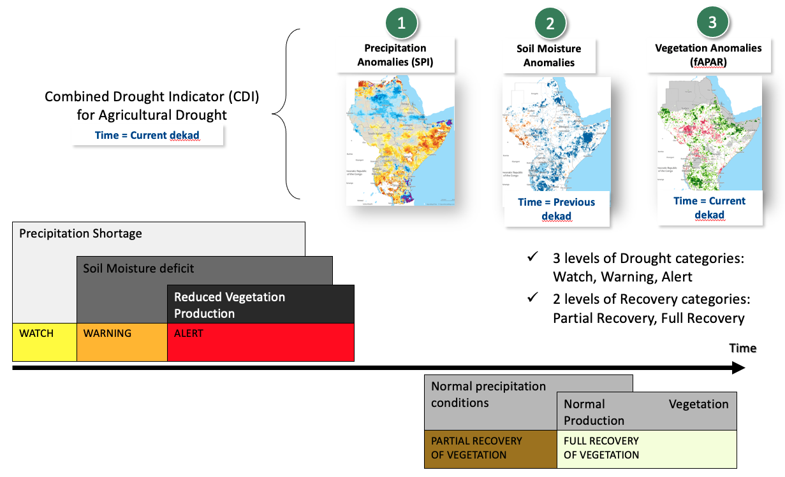
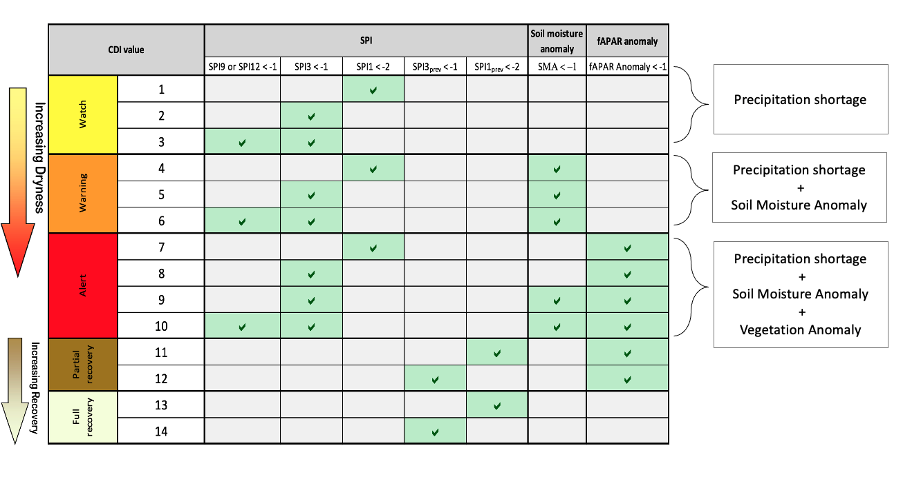
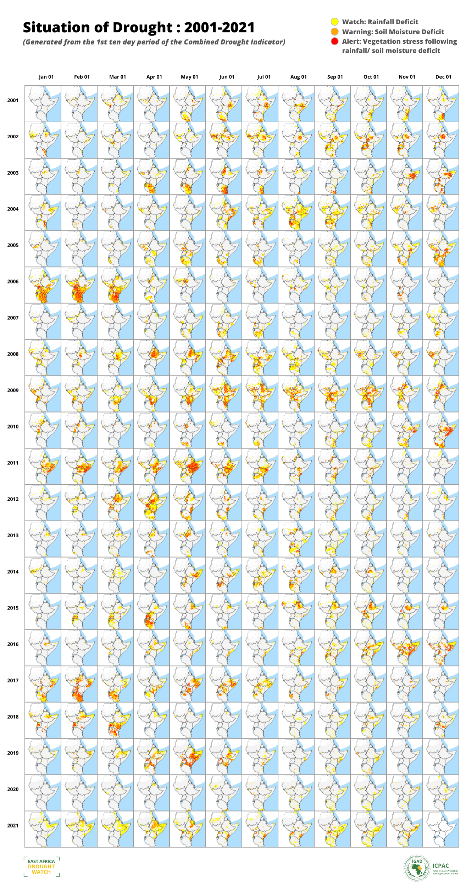

Combined Drought indicator (CDI)
=================================

Introduction
_____________________

This Factsheet provides a detailed technical description of the Combined Drought
Indicator (CDI) as implemented in the East Africa Drought Watch, and which is used for
detecting and monitoring areas that either are affected or have the potential to be
affected by agricultural drought.

The meteorological, hydrological and satellite-derived biophysical upon which the CDI
indicator produced by EADW is based, as well as the indicator’s temporal and spatial
scales and geographic coverage, are summarised below.

+--------------------+---------------------------------+
| **Variable**       | - Precipitation Anomalies (SPI) |
|                    |                                 |
|                    | - fAPAR Anomalies               |
|                    |                                 |
|                    | - Soil Moisture Anomalies       |
+--------------------+---------------------------------+
| **Temporal Scale** | 10 days (= 1 dekad)             |
+--------------------+---------------------------------+
| **Spatial Scale**  | 0.1 Decimal Degrees/10 km       |
+--------------------+---------------------------------+
| **Coverage**       | Greater Horn of Africa          |
+--------------------+---------------------------------+

------------

Overview
_____________________

Combined Drought Indicator based on SPI (from CHIRPS), soil moisture and fAPAR, to
identify areas with potential to suffer agricultural drought, areas where the
vegetation is already affected by drought conditions, and areas in recovery process
to normal conditions after a drought episode. The method is based in 5 impact levels.

These levels are:

- **'Watch'** when a relevant precipitation shortage is observed,

- **'Warning'** when this precipitation shortage comes with a soil moisture anomaly,

- **'Alert'** when these two conditions are accompanied with an anomaly in the vegetation condition,

- **'Partial recovery'** when after a drought episode, the meteorological conditions are recovered to normal but not the vegetation conditions,

- **'Full recovery'** when meteorological and vegetation normal conditions are recovered.

------------

What the indicator shows
_________________________________________________________________________________

Agricultural drought, which is one of the three main types of drought (the others being
meteorological and hydrological droughts) that are defined according to the affected
variables of the hydrological cycle, is characterized by a reduced crop production due
to insufficient soil moisture.

The Combined Drought Indicator (CDI) identifies areas with the potential to suffer
agricultural drought, areas where the vegetation is already affected by drought
conditions, and areas in the process of recovery to normal conditions after a drought
episode. The CDI is based on the cause-effect relationship for agricultural drought,
whereby a shortage of precipitation leads to a soil moisture deficit, which in turn
results in a reduction of vegetation productivity. The indicator is computed by
combining anomalies of precipitation, soil moisture and satellite-measured plant
growth - as measured by, respectively, indicators Standardized Precipitation Index,
Soil Moisture Anomaly, and FAPAR Anomaly – using a classification scheme consisting
of five drought levels (corresponding to the different stages of the cause-effect
relationship for agricultural drought).

------------

How the indicator is computed
_________________________________________________________________________________

The Combined Drought Indicator (CDI) is derived by integrating the following three
main drought indicators, which are implemented operationally within the system:

1. **Standardized Precipitation Index (SPI)**: The SPI indicator measures precipitation anomalies at a given location, based on a comparison of observed total precipitation amounts for an accumulation period of interest (e.g. 1, 3, 12, 48 months), with the long-term historic rainfall record for that period (McKee et al., 1993; Edwards and McKee, 1997).

2. **Soil Moisture Anomaly (SMA)**: The SMA indicator is derived from anomalies of estimated daily soil moisture (or soil water) content - represented as standardized soil moisture index (SMI) - which is produced by the JRC’s LISFLOOD hydrological model (de Roo et al. 2000), and which has been shown to be effective for drought detection purposes (Laguardia and Niemeyer, 2008).

3. **FAPAR Anomaly**: The FAPAR Anomaly indicator is computed as deviations of the biophysical variable Fraction of Absorbed Photosynthetically Active Radiation (FAPAR), composited for 10- day intervals, from long-term mean values. Satellite-measured FAPAR represents the fraction of incident solar radiation that is absorbed by land vegetation for photosynthesis, and is effective for detecting and assessing drought impacts on vegetation canopies (Gobron et al., 2005).

The one-month, three-month, nine-month and twelve-month Standardized
Precipitation Index (SPI-1 and SPI-3) are used for computing the CDI. Several studies
(e.g. Ji and Peter, 2003; Rossi and Niemeyer, 2012) have shown that SPI-3 has the
strongest correlation with the vegetation response, and is therefore the most suitable
for identifying agricultural drought, whereas SPI-1 can detect extreme short-term
dryness that can dramatically affect the vegetation condition depending on its stage
of development.

For SPI-3, SPI-9, SPI-12, FAPAR Anomaly and Soil Moisture Anomaly (SMA) indicators, a
threshold of minus one (-1) standard deviation is used, which equates to a return
period of 6.3 years, and corresponds to “moderate drought”, according to the SPI
classification of McKee et al. (1993). In the case of SPI-1, a threshold of minus two (-2)
standard deviations is used, corresponding only to cases identified as extreme
drought. The classification scheme that is used to assign areas to one of the five
drought classes is summarised BELOW as well as the colour scheme used for depiction
in the CDI maps

In applying the classification scheme, a temporal lag between the three components
of the CDI is implemented. Thus, SPI of a given month is contrasted with soil moisture
anomalies of the 2nd and 3rd dekads of that month, and with the 1st dekad of the
following month, and with FAPAR anomalies of the 3rd dekad of that month and the
1st and 2nd dekads of the following month. Each month is assumed to have three
dekads (days 1-10; days 11-20; day 21 to the end of the month)

------------

How to use the indicator
_______________________________________

An assessment of the behaviour of the Combined Drought Indicator (CDI) for the main
droughts between 2010 and 2021 demonstrated the CDI’s capability to discriminate
the areas where the drought impacts were most severe.

The CDI was able to identify the areas suffering more severely the drought. . It also
shows its potential as an early warning system, identifying the areas with potential to
suffer drought effects (i.e. “Watch”), later on confirming this (i.e. “Warning”) and
identifying the areas where the vegetation condition was being affected (i.e. “Alert”).

------------

Strengths
_____________________

- Generally the assessment of drought is done using individual indicators that are based on meteorological or hydrological data, or remote sensing imagery. The development of a combined indicator that integrates meteorological, hydrological
  and remote sensing data, can help to reduce false alarms, which may arise for example in the case of vegetation-based indicators (e.g. FAPAR Anomaly) where a
  biomass reduction can be caused by factors other than a drought-induced water
  stress.

- An integrated approach that provides a convergence of indicators and therefore
  evidence of drought, can also support policy-makers in effective risk management
  and decision-making.

------------

Weaknesses
_____________________

- The satellite-derived FAPAR Anomaly indicator is based on reflected solar radiation, with wavelengths in the optical (i.e. visible and infrared wavelength) region of the electromagnetic spectrum, and is therefore not effective in the presence of clouds. Clouds are generally masked out before the indicator is computed. However, low clouds are not always detected, resulting in erroneous indicator values. This is a particular problem in northern European countries. One way to address this issue would be to use more than one indicator related to vegetation growth.

------------

References
____________

- De Roo, A., C. Wesseling, and W. van Deursen. 2000. Physically based river basin
    modelling within a GIS: the LISFLOOD model, Hydrological Processes, 14, 1981–1992.
    https://doi.org/10.1002/1099-1085(20000815/30)14:11/12<1981::AIDHYP49>3.0.CO;2-F
- Edwards, D.C. and T.B. McKee. 1997. Characteristics of 20th Century Drought in
    the United States at Multiple Time Scales. Climatology Report Number 97-2.
    Colorado State University, Fort Collins.
- Gobron N., B. Pinty, F. Mélin, M. Taberner, M.M. Verstraete, A. Belward, T. Lavergne,
    and J.-L. Widlowski. 2005. The state of vegetation in Europe following the 2003
    drought. International Journal of Remote Sensing, 26 (9): 2013-2020.
    https://doi.org/10.1080/01431160412331330293
- Ji, L. and A. Peters. 2003. Assessing vegetation response to drought in the northern
    Great Plains using vegetation and drought indices. Remote Sens. Environ., 87: 85-98
- McKee, T.B., N.J. Doesken and J. Kleist. 1993. The relationship of drought frequency
    and duration to time scale. In: Proceedings of the Eighth Conference on Applied
    Climatology, Anaheim, California, 17–22 January 1993. Boston, American
    Meteorological Society, 179–184.
- Laguardia, G. and S. Niemeyer. 2008. On the comparison between the LISFLOOD
    modelled and the ERS/SCAT derived soil moisture estimates. Hydrology and Earth
    System Sciences, 12, 1339- 1351. https://www.hydrol-earth-systsci.net/12/1339/2008/
- Rossi, S. and S. Niemeyer. 2012. Drought Monitoring with estimates of the Fraction
    of Absorbed Photosynthetically-active Radiation (fAPAR) derived from MERIS. In:
    Wardlow, B., M. Anderson, and J. Verdin (Editors). Remote Sensing for Drought:
    Innovative Monitoring Approaches. CRC Press, and Taylor and Francis, Boca Raton,
    FL, USA. Pages 95-116.
- Sepulcre-Canto, G., S. Horion, A. Singleton, H. Carrão, and J. Vogt. 2012.
    Development of a Combined Drought Indicator to detect agricultural drought in
    Europe. Natural Hazards and Earth System Sciences, 12, 3519-3531.

`CDI Factsheet: <https://droughtwatch.icpac.net/documents/2/EADW-CDI-Factsheet.pdf>`_ 

:download:`Download CDI Data <https://droughtwatch.icpac.net:5000/IGAD_Combined_Drought_Indicator/CHIRPS/>` 