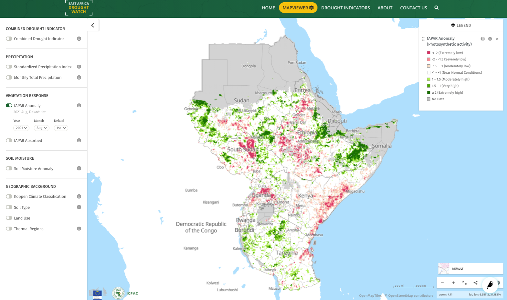

Fraction of Absorbed Photosynthetically Active Radiation (FAPAR)
=================================================================

The Fraction of Absorbed Photosynthetically Active Radiation (FAPAR) is biophysical variable, derived from satellite observations, that represents the 
fraction of incident solar radiation that is absorbed by land vegetation for photosynthesis.

------------

Overview
_________________________________________________________________________________

The FAPAR Anomaly indicator is computed as deviations of the satellite-measured biophysical variable Fraction of Absorbed Photosynthetically Active Radiation (FAPAR, 
sometimes written as fAPAR or FPAR), composited for 10-day intervals, from its long-term mean values. FAPAR is one of the 50 so-called “Essential Climate Variables” (ECVs) 
that have been defined by the Global Climate Observing System (GCOS) as being both feasible for global climate observation, and important to support the work 
of the United Nations Framework Convention on Climate Change (UNFCCC) and the Intergovernmental Panel on Climate Change (IPCC) (Bojinski et al., 2014). 
(Of the 50 ECVs, 26 are listed as being significantly dependent on satellite observations). 

FAPAR values and their anomalies have been shown to be good indicators for detecting and assessing drought impacts on plant canopies, such as agricultural crops and 
natural vegetation (Gobron et al., 2005), and thus provide information that is potentially useful for water and agricultural management purposes.

Both fAPAR and fAPAR Anomalies are made available every ten days sourced from the `Global Drought Observatory <hhttps://edo.jrc.ec.europa.eu/edov2/php/index.php?id=1111>`_.

`Read more (GDO factsheet) <https://edo.jrc.ec.europa.eu/documents/factsheets/factsheet_fapar_gdo.pdf>`_ 