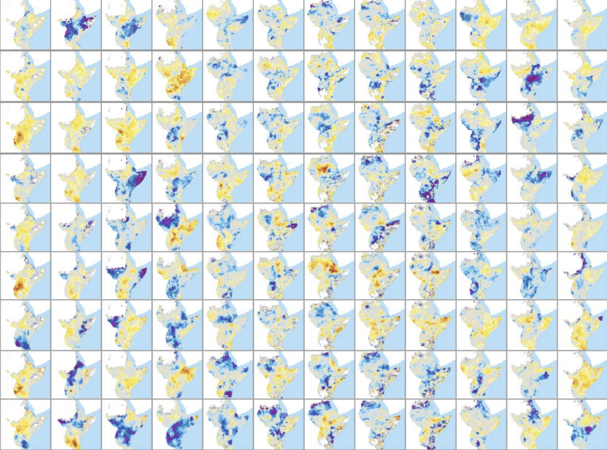
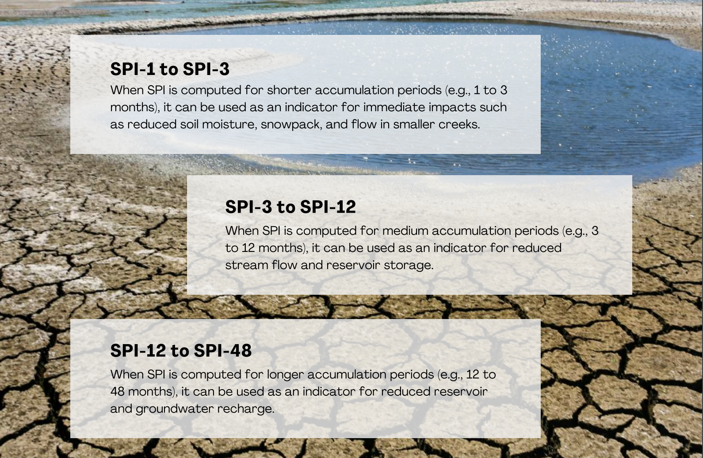
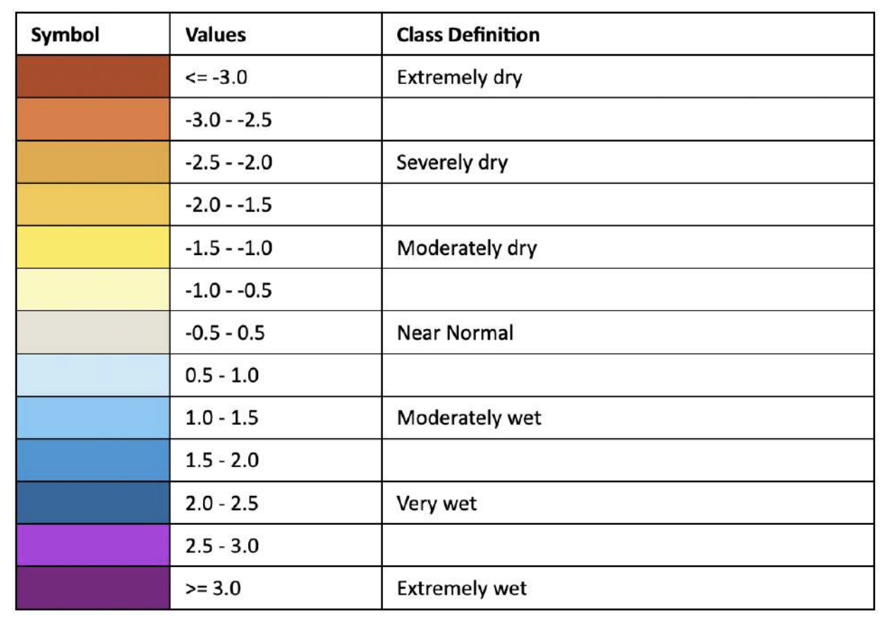

Standardized Precipitation Index (SPI)
=======================================

The SPI is a statistical index comparing the total precipitation received at a particular location during a period of n months with the long-term precipitation distribution for the same period of time at that location (reference period is 1981-2010).

The SPI indicator shows the anomalies (deviations from the mean) of the observed total precipitation, for any given location and accumulation period of interest.

Currenlty, th system implements two SPI products generated from their repsective sources computed using the same procedure:
 
1. CHIRPS Based SPI:
   
   - Spatial Resolution : 0.05 Decimal degrees or 5km
   
   - Source :
  
2. GPCC Based SPI
   
   - Spatial Resolution : 1 Decimal degrees or 100km
   
   - Source :

Both SPI products are generated monthly for a range of accumulation periods covering the Greater Horn of Africa.

----------

Overview
_____________________

The Standardized Precipitation Index (SPI) is the most commonly used indicator
worldwide for **detecting and characterizing meteorological droughts**. The SPI
indicator, which was developed by McKee et al. (1993), and described in detail by
Edwards and McKee (1997), measures **precipitation anomalies** at a given location,
based on a comparison of observed total precipitation amounts for an **accumulation
period of interest** (e.g. 1, 3, 12, 48 months), with the **long-term historic rainfall record**
for that period.

The historic record is **fitted** to a **probability distribution (the “gamma” distribution)**,
which is then transformed into a normal distribution such that the mean SPI value for
that location and period is zero. For any given region, increasingly severe rainfall
deficits (i.e., meteorological droughts) are indicated as SPI decreases below ‒1.0, while
increasingly severe excess rainfall are indicated as SPI increases above 1.0.

Because SPI values are in units of standard deviation from the long-term mean, the
indicator can be used to compare precipitation anomalies for any geographic location
and for any number of time-scales. Note that the name of the indicator is usually
modified to include the accumulation period. Thus, SPI-3 and SPI-12, for example, refer
to accumulation periods of three and twelve months, respectively.

The World Meteorological Organization has recommended that the SPI be used by all
National Meteorological and Hydrological Services around the world to characterize
meteorological droughts (World Meteorological Organization, 2012). The long-term
gamma distribution of our product is based on data from a reference period from
**1981 to 2010** (included). The data included in the SPI-48 (4 years SPI) are thus based on
monthly rainfall input data from 1978 until 2010

----------

What the indicator shows
________________________________________

A **meteorological drought** is defined as a period with an abnormal precipitation
deficit, in relation to the long-term average conditions for a region.

The SPI indicator shows the **anomalies (deviations from the mean)** of the observed
total precipitation, for any given location and accumulation period of interest. The
magnitude of the departure from the mean is a probabilistic measure of the severity
of a wet or dry event.

Since SPI can be calculated over different precipitation accumulation periods (typically
ranging from 1 to 48 months), the resulting different SPI indicators allow for estimating
different **potential impacts** of a meteorological drought:

----------

How the indicator is computed
_________________________________________

**For SPI based on CHIRPS**, it is computed using CHIRPS/CHIRP Precipitation data from the UC Santa
Barbara, specifically 'Preliminary' product (CHIRP) for the first 3 weeks of the
previous month prior to current month, then updated to 'Monitoring/final' product
(CHIRPS) within the 3rd week of the same month depending on availability.

**For SPI Based on GPCC**, it is computed from the monthly precipitation data provided by the Global 
Precipitation Climatology Centre (GPCC - http://gpcc.dwd.de/), specifically 'First guess' product 
for the two months prior to current month, then updated to 'Monitoring (version 4)' product for 
the three months prior to current and backwards.

A **Gamma distribution** is fit onto the baseline data of **reference period 1981-2010**
generating both alpha (shape parameter of the gamma distribution (also referred to
as the concentration) computed from the {scale}-month scaled precipitation values)
and beta (1 / scale of the distribution (also referred to as the rate) computed from the
{scale}-month scaled precipitation values) parameters for a period of 7 accumulation
months (1, 3, 6, 9, 12, 24, 48).

The SPI is computed based on measurements of **precipitation anomalies** at a given
location, from a comparison of observed total precipitation amounts for an
accumulation period of interest with the long-term historic rainfall record for that
period.

----------

How to use the indicator
_________________________________________

Increasingly severe rainfall deficits (i.e., meteorological droughts) are indicated as SPI
decreases below ‒1.0, while increasingly severe excess rainfall is indicated as SPI
increases above 1.0. In EADW, the SPI indicator can be displayed either in the form of
maps, or as time series graphs in a report

----------

Strengths
_________________________________________

- The fact that SPI values are in units of standard deviation from the long-term
  mean, **allows SPI to be computed and compared** for any geographic location and
  for any number of time scales.

- In addition, because the SPI is normalized it is just as **effective** in **analysing wet**
  periods and cycles, as it is in analysing **dry** periods and cycles.

- The SPI indicator is **based on only one input parameter** (precipitation
  accumulations), and thus it is **less complex to compute** than other drought
  indicators, such as the Palmer Drought Severity Index, which also takes account of
  variations in temperature, soil moisture and evapotranspiration.

----------

Weaknesses
_________________________________________

- As mentioned earlier, the parameters of the gamma distribution are calculated
  (fitted) using historical non-zero rainfall accumulations. The cumulative probability
  of observed rainfall is then adjusted using the probability (frequency) of zero
  rainfall accumulations. However, **if there are many historical zero rainfall
  accumulations, the estimated gamma distribution may not adequately fit the
  frequency distribution of the historical rainfall**. Therefore, in regions with a high
  probability of zero rainfall, the SPI indicator should be interpreted with care. In
  such cases (typical of arid climates), the concept of a drought needs to be
  adapted, and it may be best to restrict SPI calculation and analysis to the normal
  rainy season, or to use alternative drought indicators.

- Because SPI is based only on precipitation, it **does not address the effects of high
  temperatures on drought conditions**, such as by damaging cultivated and natural
  ecosystems, and increasing evapotranspiration and water stress. A new variation
  of SPI, the **Standardized Precipitation and Evapotranspiration Index** (SPEI), 
  has been developed (Vicente-Serrano et al., 2010), which includes precipitation and 
  temperature, in order to identify increases in drought severity linked with higher
  water demand by evapotranspiration. The SPEI has the advantage over the Palmer Drought Severity Index (PDSI), for example, in that it captures the “multiscalar” 
  characteristic of drought, whereby water deficits accumulate over different timescales, 
  differentiating between hydrological, environmental, agricultural, and other droughts.

----------

References
________________________

- Abramowitz, M. and I. A. Stegun (eds). 1964. Handbook of Mathematical Functions
    with Formulas, Graphs, and Mathematical Tables. National Bureau of Standards,
    Applied Mathematics Series, 55.
- Edwards, D.C. and T.B. McKee. 1997. Characteristics of 20th Century Drought in
    the United States at Multiple Time Scales. Climatology Report Number 97-2.
    Colorado State University, Fort Collins.
- Greenwood, J.A., and D. Durand, 1960. Aids for fitting the gamma distribution by
    maximum likelihood. Technometrics, 2, 55-65.
- Haylock, M.R., N. Hofstra, A.M.G. Klein Tank, E.J. Klok, P.D. Jones, and M. New. 2008: A
    European daily high-resolution gridded dataset of surface temperature and
    precipitation. Journal of Geophysical Research, Vol. 113, D20119,
    doi:10.1029/2008JD10201
- McKee, T.B., N.J. Doesken and J. Kleist. 1993. The relationship of drought frequency
    and duration to time scale. In: Proceedings of the Eighth Conference on Applied
    Climatology, Anaheim, California, 17–22 January 1993. Boston, American
    Meteorological Society, 179–184.
- Press, W.H., S.A. Teukolsky, W.T. Vetterling, and B.P. Flannery. 1992. Numerical
    Recipes in C: The Art of Scientific Computing. 2nd Edition. Cambridge University
    Press. ISBN 0-521-43108-5. 994p.
    Thom, H.C.S. 1958. A Note on the Gamma Distribution. Monthly Weather Review,
    86(4).
- Vicente-Serrano, S.M., S. Beguería and J.I. López-Moreno. 2010. A multi-scalar
    drought index sensitive to global warming: the Standardized Precipitation
    Evapotranspiration Index. Journal of Climate, 23(7): 1696-1718.
    https://doi.org/10.1175/2009JCLI2909.1.
- World Meteorological Organization. 2012. Standardized Precipitation Index User
    Guide. (M. Svoboda, M. Hayes and D. Wood). WMO-No. 1090. Geneva. ISBN 978-92-
    63-11091-6. 16p

