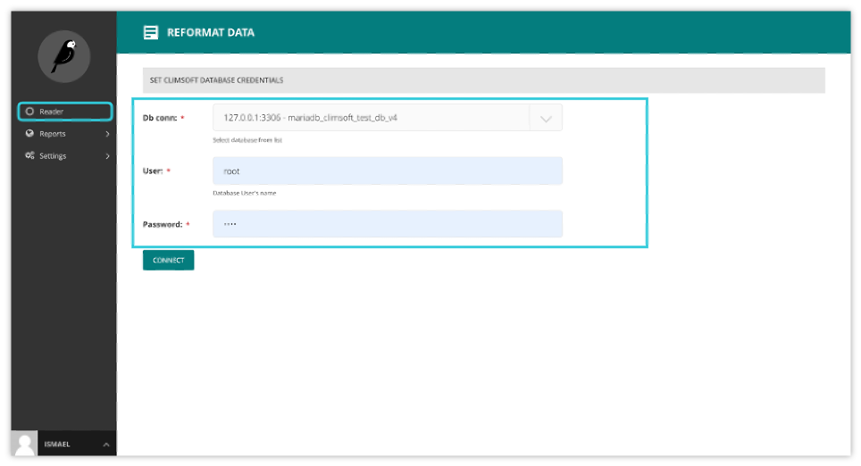
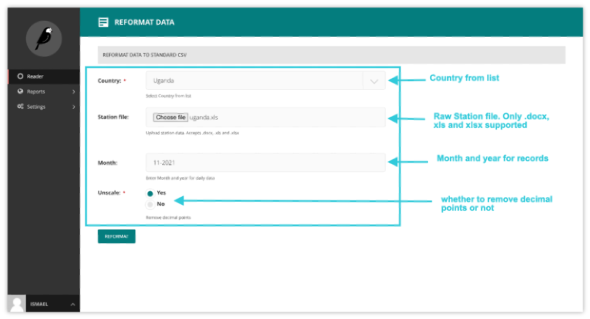
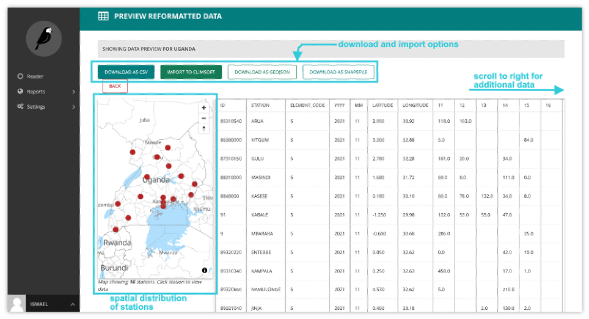
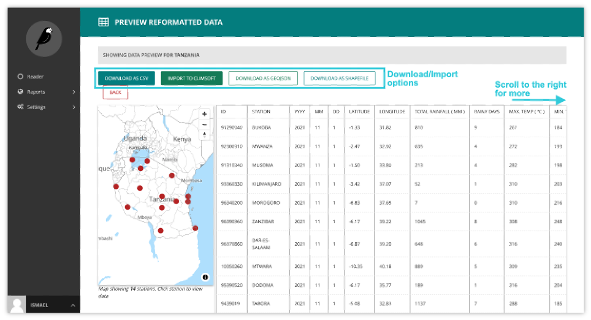

Usage
=======

Prerequisites
______________________________________

The read-in tool supports xlsx, xls and docx formats. All doc should be converted to docx before reformatting. 
This tool assumes country-specific structures remain consistent.

.. note:: a slight change in the structure of the raw station file may lead to unsuccessful reformatting.

Logging in
____________

The first port of call for an editor is the login page for the administrator interface. Access this by adding /cms onto the end of your root URL (e.g. https://droughtwatch.icpac.net/cms). Enter your username and password and click Sign in.

.. image:: ../_static/maintenance_guide/loggin.png
   :align: center

Connection to database
______________________________________

This involves providing username and password credentials for a selected database during login to the read-in tool. Database connection credentials i.e., host/IP Address, database name and port are preconfigured at admin level. 

Reformat Station Data
______________________________________

Daily data
-------------

For daily station data:

1. Select country from list

2. Load station-specific data file

3. Select year and month. (days will be automatically picked from the station file)

4. Unscale (default set to yes where all decimal values will be converted to whole numbers)

A preview of the reformatted station data will be shown. Notice the unscaling for rainfall and temperature values.

The tool allows download of reformatted data in csv, shapefile or geojson format.  It also supports direct import into ClimSoft database.

Dekadal data
--------------

For dekadal station data:

1. Select country from list

2. Load station-specific data file

3. Select date

4. Unscale (default set to yes where all decimal values will be converted to whole numbers)

A preview of the reformatted station data will be shown. Notice the unscaling for rainfall and temperature values.

