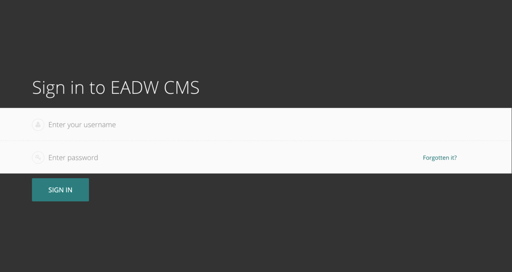
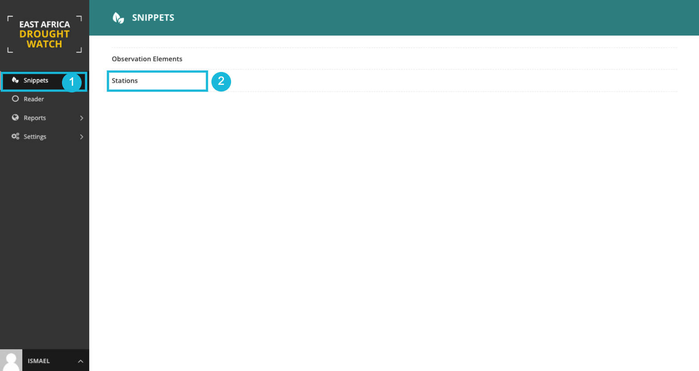
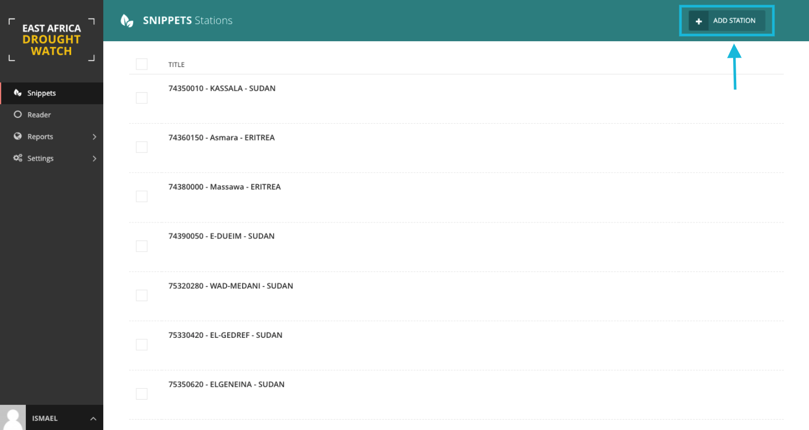
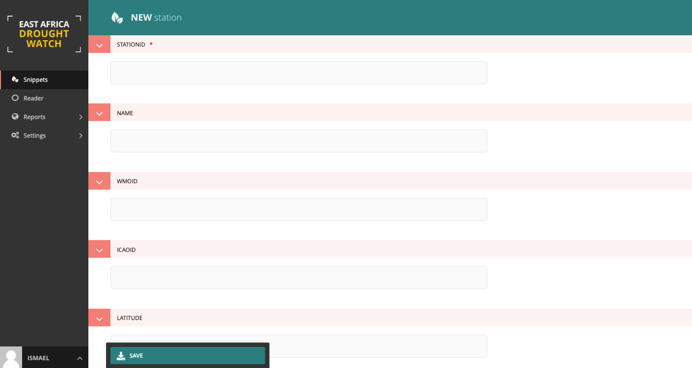
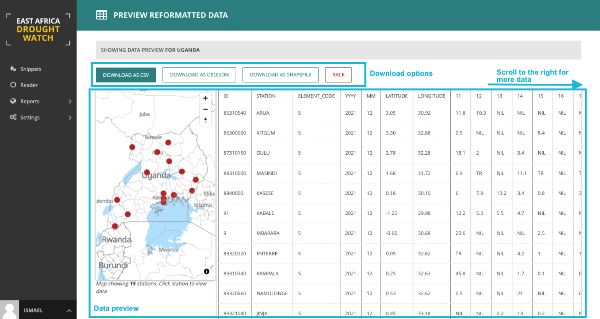
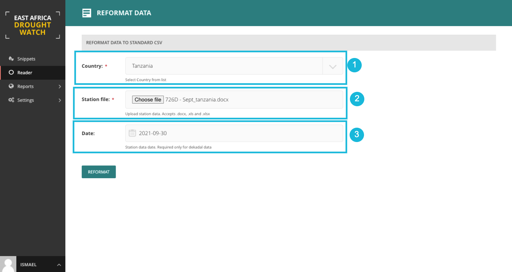
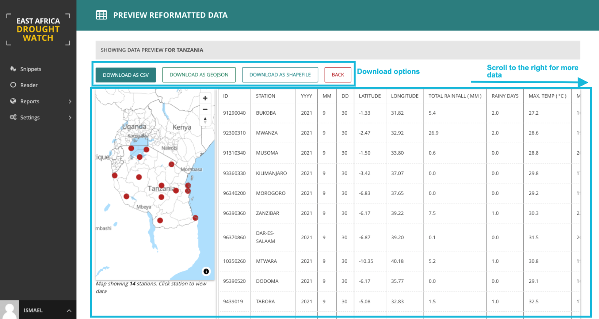

Usage
=======

Prerequisites
______________________________________

The read-in tool supports xlsx, xls and docx formats. All doc should be converted to docx before reformatting. 
This tool assumes country-specific structures remain consistent.

.. note:: a slight change in the structure of the raw station file may lead to unsuccessful reformatting.

Logging in
____________

The first port of call for an editor is the login page for the administrator interface. Access this by adding /cms onto the end of your root URL (e.g. https://droughtwatch.icpac.net/cms). Enter your username and password and click Sign in.

Creating/Updating Stations
______________________________________

As a data manager on the CMS, you are capable of creating new stations which will be referenced during reformating. To create a station, follow the steps below:

First, select '**snippets**' on the left sidebar then select Stations. 

Fill the fields appropriately and save.

----------

Reformat Station Data
______________________________________

Daily data
-------------

For daily station data:

1. Select country from list

2. Load station-specific data file

3. Select year and month. (days will be automatically picked from the station file)

A preview of the reformatted station data will be shown.

The tool allows download of reformatted data in csv, shapefile or geojson format.

Dekadal data
--------------

For dekadal station data:

1. Select country from list

2. Load station-specific data file

3. Select date

A preview of the reformatted station data will be shown. 

