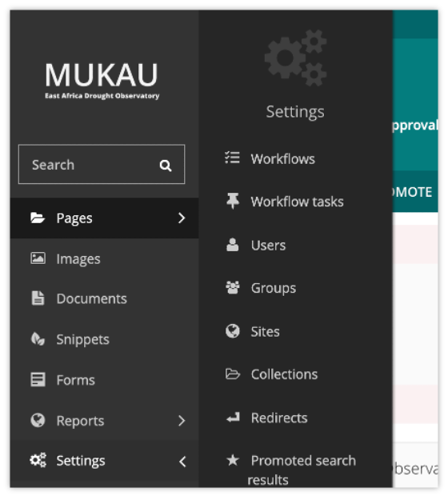
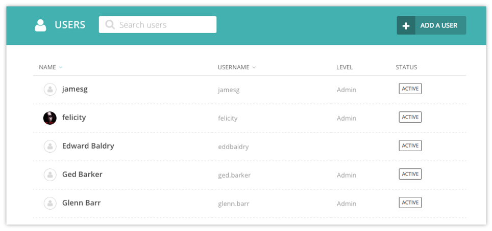
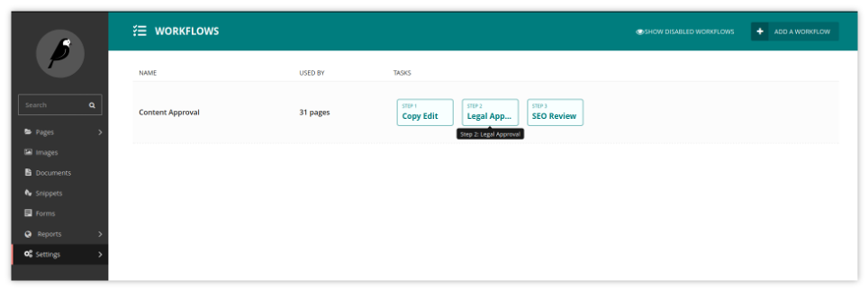
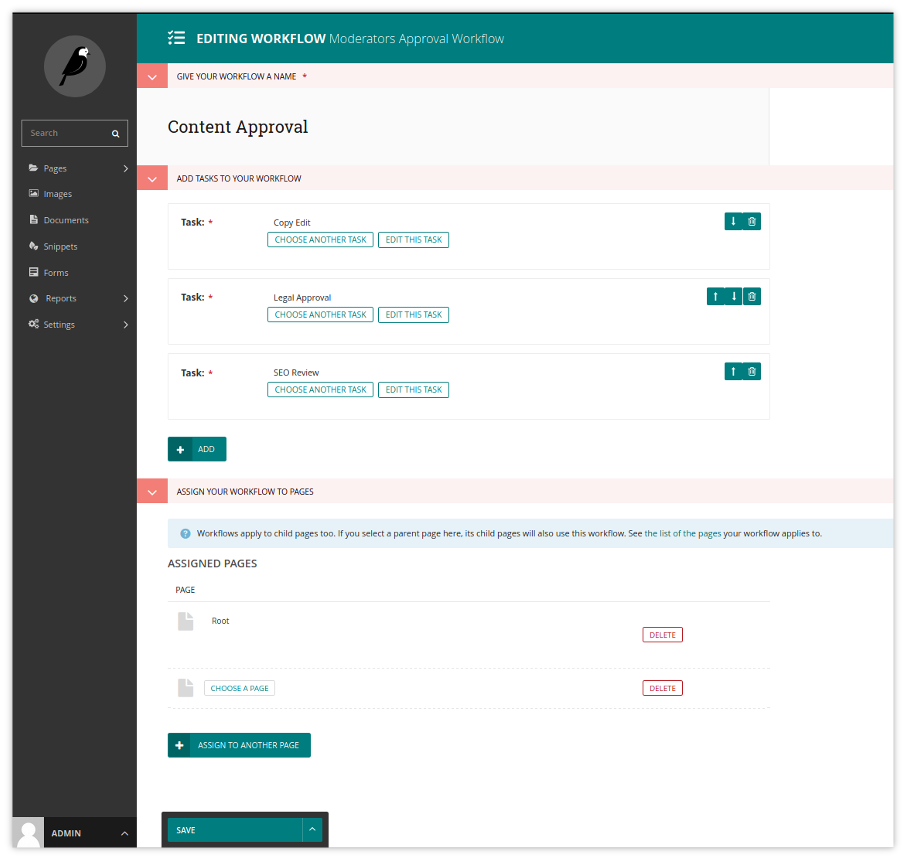
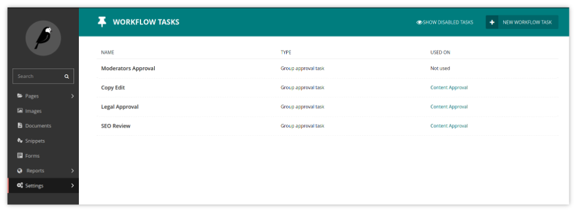
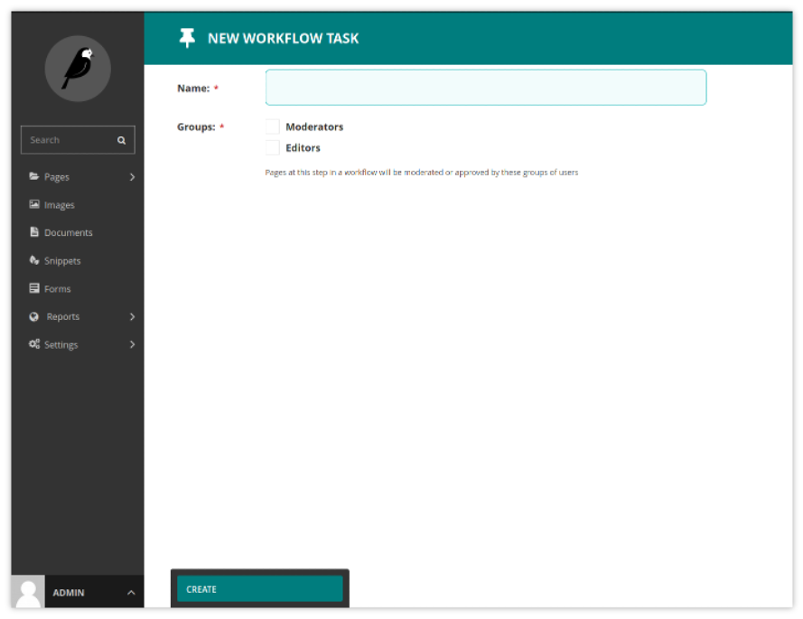

CMS Administrator Tasks
=========================

This section of the guide documents how to perform common tasks as an administrator of Mukau's CMS Site.

.. contents::

Managing users and roles
-------------------------

As an administrator, a common task will be adding, modifying or removing user profiles.
This is done via the ‘Users’ interface, which can be found in the Settings menu, accessible via the left-hand menu bar.

In this interface you can see all of your users, their usernames, their ‘level’ of access (otherwise known as their ‘role’), and their status, either active or inactive.
You can sort this listing either via Name or Username.

Clicking on a user’s name will open their profile details. From here you can then edit that users details.

.. note:: It is possible to change user’s passwords in this interface, but it is worth encouraging your users to use the ‘Forgotten password’ link on the login screen instead. This should save you some time!

Click the ‘Roles’ tab to edit the level of access your users have. By default there are three roles:

+----------------+---------------------+------------------+-------------------+---+---+---+---+---+---+
| Role           | Create/view drafts  | Publish content  | Access Settings   |   |   |   |   |   |   |
+================+=====================+==================+===================+===+===+===+===+===+===+
| Editor         | Yes                 | No               | No                |   |   |   |   |   |   |
+----------------+---------------------+------------------+-------------------+---+---+---+---+---+---+
| Moderator      | Yes                 | Yes              | No                |   |   |   |   |   |   |
+----------------+---------------------+------------------+-------------------+---+---+---+---+---+---+
| Administrator  | Yes                 | Yes              | Yes               |   |   |   |   |   |   |
+----------------+---------------------+------------------+-------------------+---+---+---+---+---+---+

Managing Workflows
-----------------------------

Workflows allow you to configure how moderation works on your site. Workflows are sequences of tasks, all of which must be approved before the workflow completes (by default, this results in the publication of the page, but depends on your site settings).

The workflow management interface is accessed via the Workflows item in the Settings submenu, found in the left menu bar.

In this interface you can see all of the workflows on your site, and the order of tasks in each. You can click on a workflow to edit it or to assign it to part of the page tree, or use the Add a workflow button to create a new workflow. 
The number of pages each workflow applies to is also shown, and can be clicked for a complete listing.

Editing workflows
~~~~~~~~~~~~~~~~~~~~~~~

Under Add tasks to your workflow, you can add, remove, or reorder tasks in a workflow. When adding a task to a workflow, you will be given the option to create a new task, or reuse an existing one.

Under Assign your workflow to pages, you can see a list of the pages to which the workflow has been assigned: any child pages will also have the same workflow, so if a workflow is assigned to the root page, it becomes the default workflow. You may remove it from pages using the Delete button to the right of each entry, or assign it to a page using the Choose a page button.

The action menu at the bottom allows you to save your changes, or to disable the workflow, which will cancel all pages currently in moderation on this workflow, and prevent others from starting it. On a previously disabled workflow, there is also the option to enable it again.

Creating and editing tasks
-----------------------------

In the tasks interface, accessible via the Workflow Tasks item in the Settings submenu, you can see a list of the tasks currently available, as well as which workflows use each task. Similarly to workflows, you can click an existing task to edit it, or the Add a task button to create a new task.

When creating a task, if you have multiple task types available, these will be offered as options. By default, only group approval tasks are available. Creating a group approval task, you will be able to select one or multiple groups: members of any of these, as well as administrators, will be able to approve or reject moderation for this task.

When editing a task, you may find that some fields - including the name - are uneditable. This is to ensure workflow history remains consistent - if you find yourself needing to change the name, it is recommended that you disable the old task, and create a new one with the name you need. Disabling a task will cause any pages currently in moderation on that task to skip to the next task.

