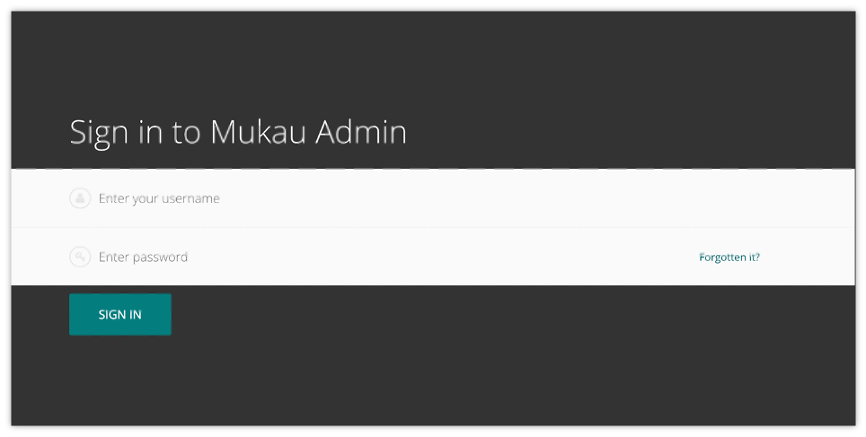
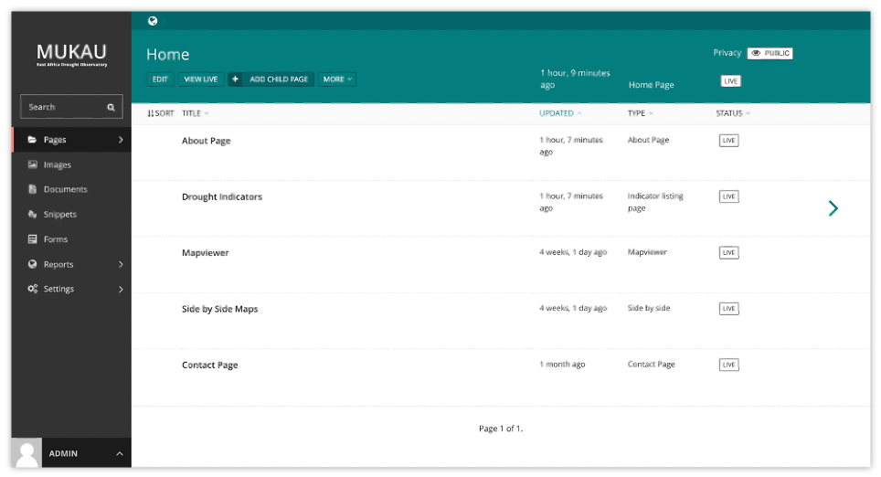
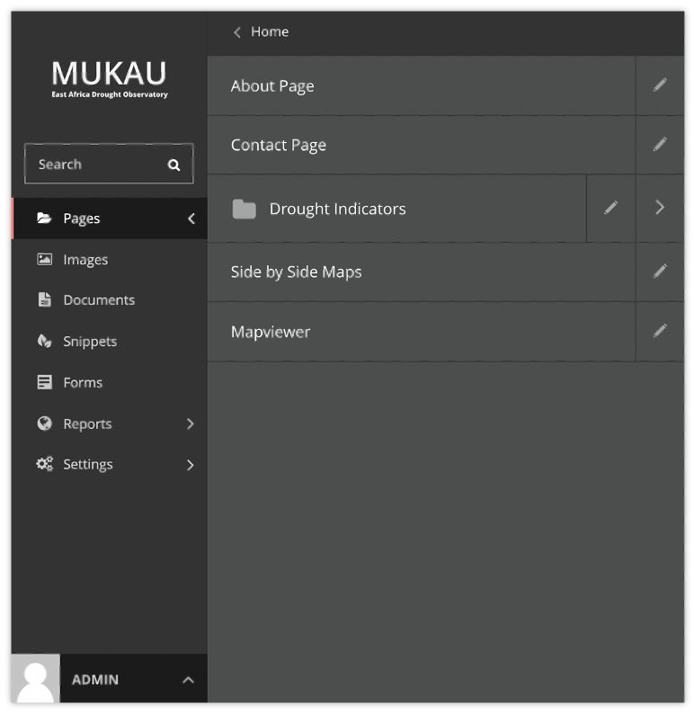
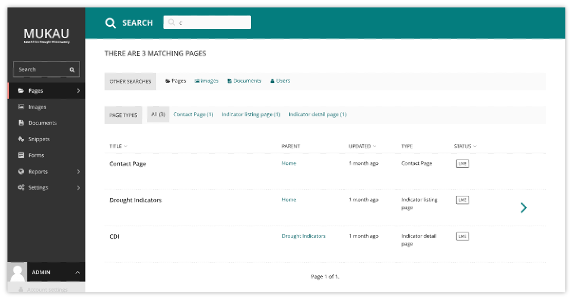
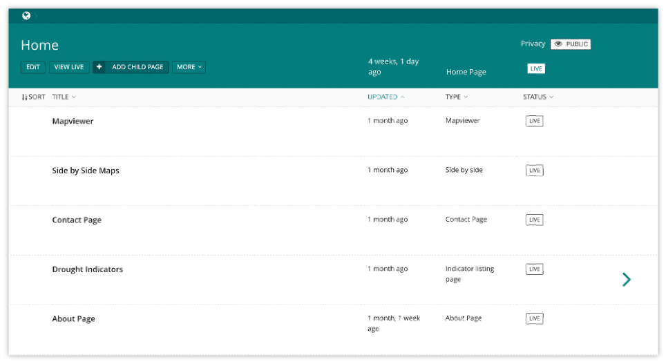
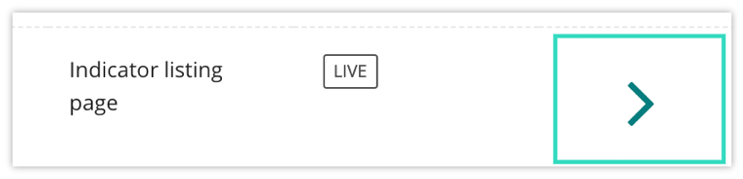
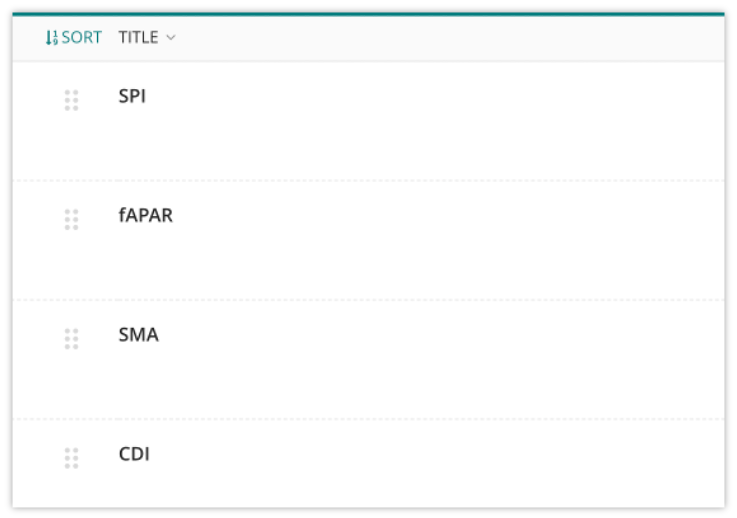

Overall CMS Components
=======================

.. contents::

Logging in
____________

The first port of call for an editor is the login page for the administrator interface. Access this by adding /admin onto the end of your root URL (e.g. https://droughtwatch.icpac.net/cms). Enter your username and password and click Sign in.

Finding your way around
________________________

You will learn about different pages that you will see as you navigate around the CMS, and how you can find the content that you are looking for.

The Dashboard
---------------

The Dashboard provides information on:

* The number of pages, images, and documents currently held in the Mukau CMS:

* Any pages currently awaiting moderation (if you have these privileges)

* Any pages that you’ve locked (if your administrator has enabled author-specific locking)

* Your most recently edited pages

You can return to the Dashboard at any time by clicking the Wagtail logo in the bottom-right of the screen.

* Clicking the logo returns you to your Dashboard. The stats at the top of the page describe the total amount of content on the CMS.

* The Your pages in a workflow panel shows you any pages in moderation that you own or submitted for moderation yourself, along with which moderation tasks they are awaiting, and how long they’ve been on that task.

* The Awaiting your review panel will only be displayed if you are able to perform moderation actions.
    
    + Clicking the name of a page will take you to the ‘Edit page’ interface for this page.
    
    + Clicking approve or request changes will either progress the page to the next task in the moderation workflow (or publish if it’s the final stage) or mark the page as needing changes and return it to normal editing. An email will be sent to the creator of the page giving the result of the overall workflow when it completes.
    
    + The status indicator circles show the progress through the workflow: a tick for a completed task, or an empty circle for an incomplete one. Tooltips provide more details on the status of each.
    
    + The time this page has been waiting for review on this task is also shown to the right.

* The Your locked pages panel shows the pages you’ve locked so that only you can edit them.

    + The date you locked the page is displayed to the right.

    + Clicking the name of a page will take you to the ‘Edit page’ interface for this page.

* The Your most recent edits table displays the five pages that you most recently edited.

    + The date that you edited the page is displayed. Hover your mouse over the date for a more exact time/date.

    + The current status of the page is displayed. A page will have one of a number of statuses:

        + Live: Published and accessible to website visitors

        + Draft: Not live on the website

        + In Moderation: In the middle of a moderation workflow

        + Scheduled: Not live, but has a publication date set

        + Expired: Not live - this page was unpublished as it had an expiry date set which has now passed

        + Live + Draft: A version of the page is live, but a newer version is in draft mode.

        + Live + (another status): A version of the page is live, but a newer version has another status.

The Explorer menu
------------------

* Click the Pages button in the sidebar to open the explorer. This allows you to navigate through the sections of the site.

* Clicking the name of a page will take you to the Explorer page for that section.

* Clicking the edit icon for a page will take you to its edit screen.

* Clicking the arrow takes you to the sub-section.

* Clicking the section title takes you back to where you were. 

Using search
-------------

A very easy way to find the page that you want is to use the main search feature, accessible from the left-hand menu. 
Simply type in part or all of the name of the page, image, document or user you are looking for, and the results below will automatically update as you type. 
Clicking the page title in the results will take you to the Edit page for that result. 
You can differentiate between similar named pages using the Parent column, which tells you what the parent page of that page is.

The Explorer page
------------------

The Explorer page allows you to view a page’s children and perform actions on them. From here you can publish/unpublish pages, move pages to other sections, drill down further into the content tree, or reorder pages under the parent for the purposes of display in menus.

* The name of the section you are looking at is displayed below the breadcrumb (the row of page names beginning with the home icon). Each section is also itself a page (in this case the homepage). Clicking the title of the section takes you to the Edit screen for the section page.

* As the heading suggests, below are the child pages of the section. Clicking the titles of each child page will take you to its Edit screen.

Clicking the arrows will display a further level of child pages.
As you drill down through the site the breadcrumb (the row of pages beginning with the home icon) will display the path you have taken. Clicking on the page titles in the breadcrumb will take you to the Explorer screen for that page.

To add further child pages press the Add child page button below the parent page title. You can view the parent page on the live site by pressing the View live button. The Move button will take you to the Move page screen where you can reposition the page and all its child pages in the site structure.
Similar buttons are available for each child page. These are made visible on hover.

* Clicking the “Sort” control in the header row will enable the reordering handles. This allows you to reorder the way that content displays in the main menu of your website. 

* Reorder by dragging the pages by the handles on the far left (the icon made up of 6 dots). 

* Your new order will be automatically saved each time you drag and drop an item.

.. toctree::
   :maxdepth: 3