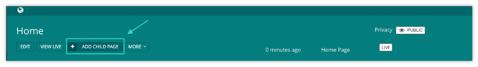
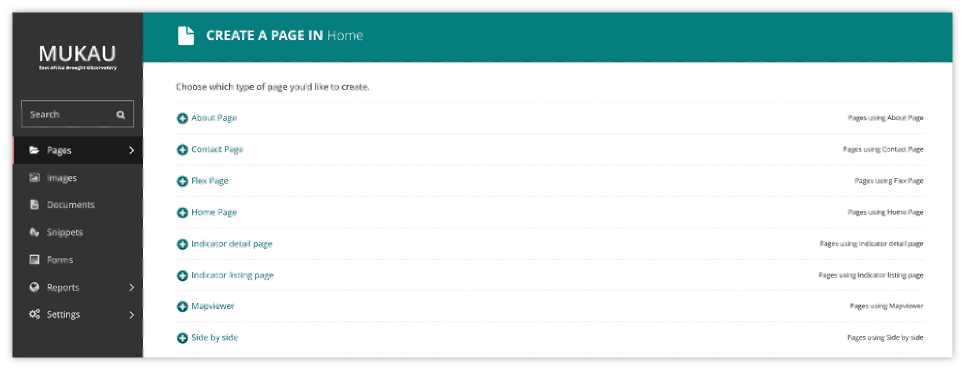
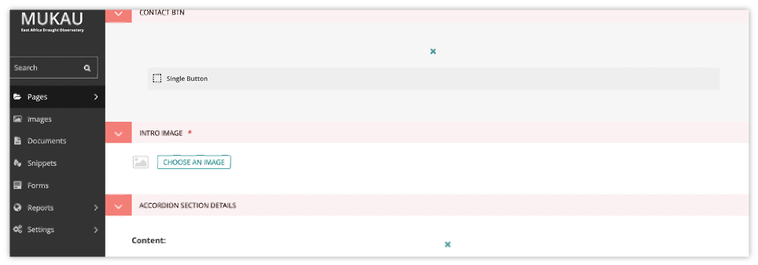
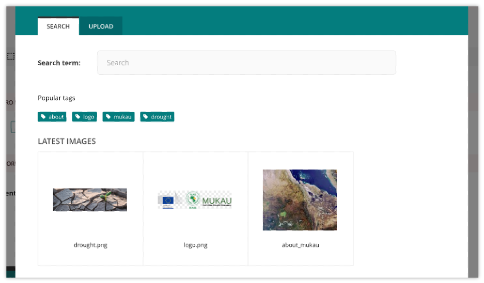
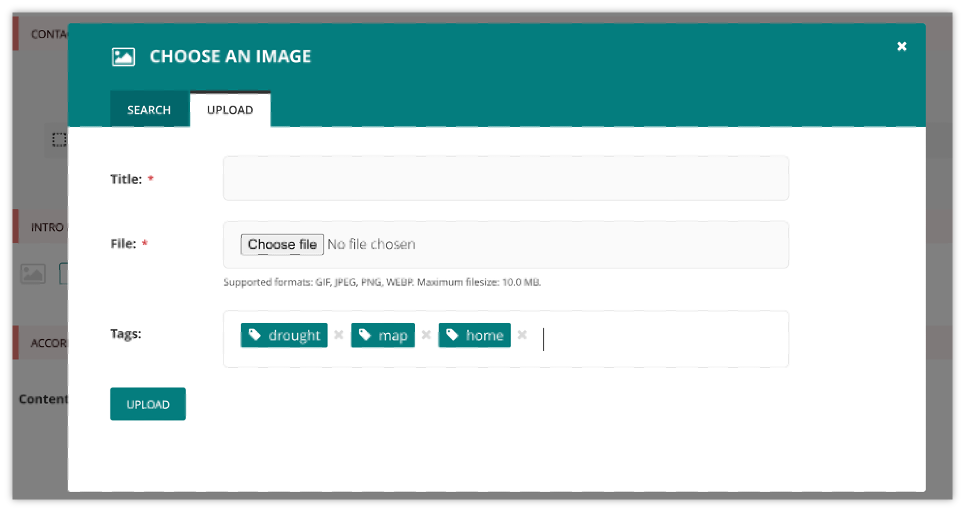
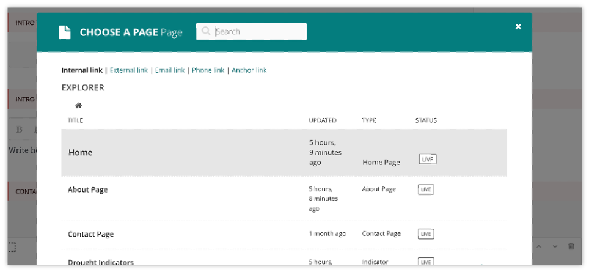

CMS Mechanism to display a webpage
=========================================

.. contents::

Creating new pages
________________________

Create new pages by clicking the Add child page button. This creates a child page of the section you are currently in. In this case a child page of the ‘Home’ page.

Selecting a page type
________________________

On the left of the page chooser screen are listed all the types of pages that you can create. Clicking the page type name will take you to the Create new page screen for that page type (see below).

Clicking the Pages using … Page links on the right will display all the pages that exist on the website of this type. This is to help you judge what type of page you will need to complete your task.

Inserting images and videos in a page
______________________________________

There may be instances in which you will want to add images to a page. There are two main ways to add images to pages, either via a specific image chooser field, or via the rich text field image button. The steps below will explain the first method.

Inserting images using the image chooser field
------------------------------------------------

Often a specific image field will be used for a main image on a page, or for an image to be used when sharing the page on social media.

You insert an image by clicking the Choose an image button.

Choosing an image to insert
------------------------------

You have two options when selecting an image to insert:

* Selecting an image from the existing image library, or…
* Uploading a new image to the CMS When you click the Choose an image button you will be presented with a pop-up with two tabs at the top. The first, Search, allows you to search and select from the library. The second, Upload, allows you to upload a new image.

Choosing an image from the image library
------------------------------------------

The image below demonstrates finding and inserting an image that is already present in the CMS image library.

1. Typing into the search box will automatically display the results below.
2. Clicking one of the Popular tags will filter the search results by that tag.
3. Clicking an image will take you to the Choose a format window (see image below).

Uploading a new image to the CMS
------------------------------------

1. You must include an image title for your uploaded image
2. Click the Choose file button to choose an image from your computer.
3. Tags allows you to associate tags with the image you are uploading. This allows them to be more easily found when searching. Each tag should be separated by a space. Good practice for creating multiple word tags is to use an underscore between each word.
4. Click Upload to insert the uploaded image into the carousel. The image will also be added to the main CMS image library for reuse in other content.

Inserting links in a page
______________________________________

Similar to images, there are a variety of points at which you will want to add links. The most common place to insert a link will be in the body text of a page. You can insert a link into the body text by clicking the Insert link button in the rich text toolbar.
Whichever way you insert a link, you will be presented with the form displayed below.

* Search for an existing page to link to using the search bar at the top of the pop-up.

* Below the search bar you can select the type of link you want to insert. The following types are available:
  
+ Internal link: A link to an existing page within your website.
  
+ External link: A link to a page on another website.

+ Email link: A link that will open the user’s default email client with the email address prepopulated.

+ Phone link: A link that will open the user’s default client for initiating audio calls, with the phone number prepopulated.

* You can also navigate through the website to find an internal link via the explorer.

Inserting videos into body content
______________________________________

It is possible to embed media into the body text of a web page by clicking the Embed button in rich text toolbar. Copy and paste the web address for the media into the URL field and click Insert.
