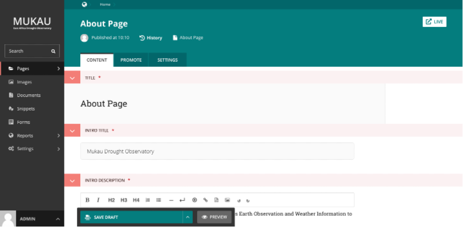

CMS Mechanism to edit a Mukau webpage
======================================

.. contents::

Edit existing pages
______________________________________

Here is how you can access the edit screen of an existing page:
Clicking the title of the page in an Explorer page or in search results. Clicking the Edit link below the title in either of the situations above. Clicking the Edit icon for a page in the explorer menu.

* When editing an existing page the title of the page being edited is displayed at the top of the page. Underneath the title, you can find the page type and a link to the page history.

* If published, a link to the live version of the page is shown on the top right.

* You can change the title of the page by clicking into the title field.

* When you are typing into a field, help text is often displayed on the right-hand side of the screen.

Workflow
______________________________________

If the page is currently in workflow, you’ll see an additional indicator underneath the title, giving the current workflow task. Clicking this will show more information about the page’s progress through the workflow, as well as any comments left by reviewers.

.. image:: ../_static/maintenance_guide/workflow.png
   :align: center

If you can perform moderation actions (for example, approval or requesting changes) on the current task, you’ll see additional options in the action menu at the bottom of the page.

.. toctree::
   :maxdepth: 3