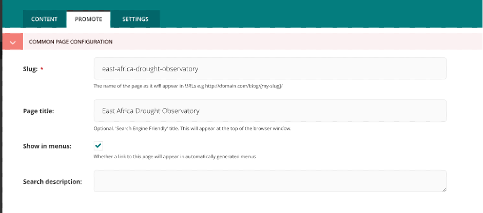
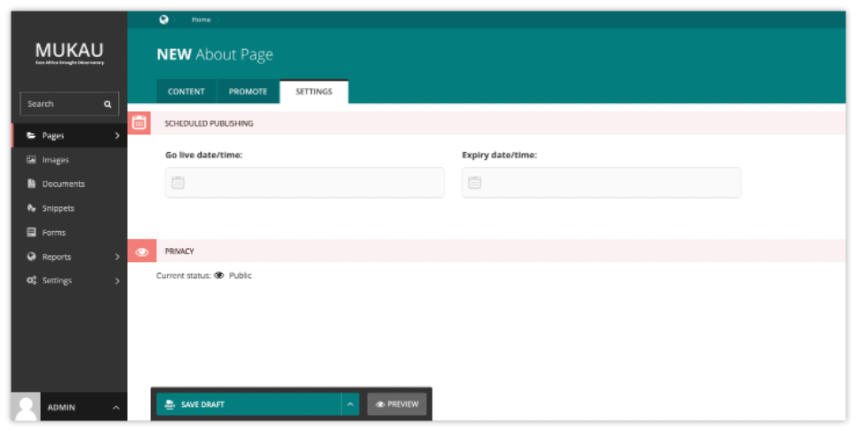

Edit Page tabs
===============

.. contents::

A common feature of the Edit pages for all page types is the three tabs at the top of the screen. The first, Content, is where you build the content of the page itself.

The Promote tab
______________________________________

The second, Promote, is where you can set all the ‘metadata’ (data about data!) for the page. Below is a description of all default fields in the promote tab and what they do.
1. **Slug**: The last part of the web address for the page. E.g. the slug for a blog page called ‘East Africa Drought Watch would be east-africa-drought-watch. This is automatically generated from the main page title set in the Content tab. This can be overridden by adding a new slug into the field. Slugs should be entirely lowercase, with words separated by hyphens (-). 
   
2. **Page title**: An optional, search-engine friendly page title. This is the title that appears in the tab of your browser window. It is also the title that would appear in a search engine if the page was returned as part of a set of search results. 

3. **Show in menus**: Ticking this box will ensure that the page is included in automatically generated menus on your site. Note: A page will only display in menus if all of its parent pages also have Show in menus ticked. Search description: This field allows you to add text that will be displayed if the page appears in search results. This is especially useful to distinguish between similarly named pages.

The Settings Tab
______________________________________

The Settings tab has two fields by default.

1. **Go Live date/time**: Sets the time at which the changes should go live when published. See Scheduled Publishing for more details. 

2. Expiry date/time: Sets the time at which this page should be unpublished.