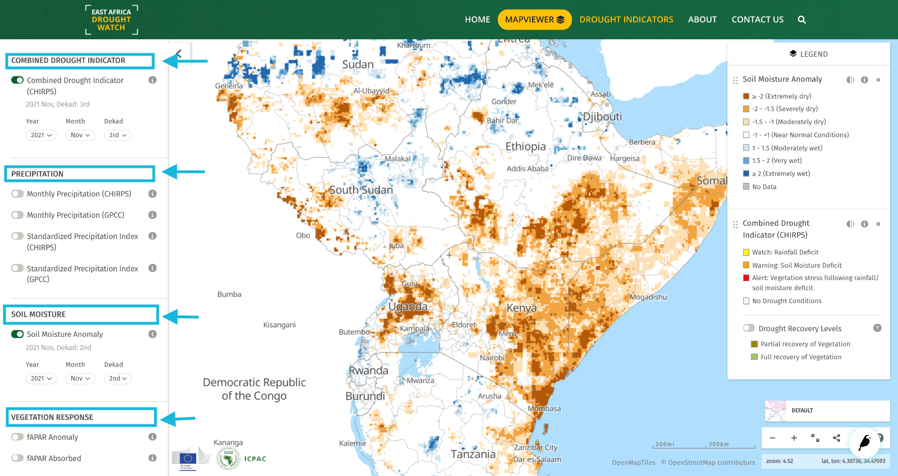
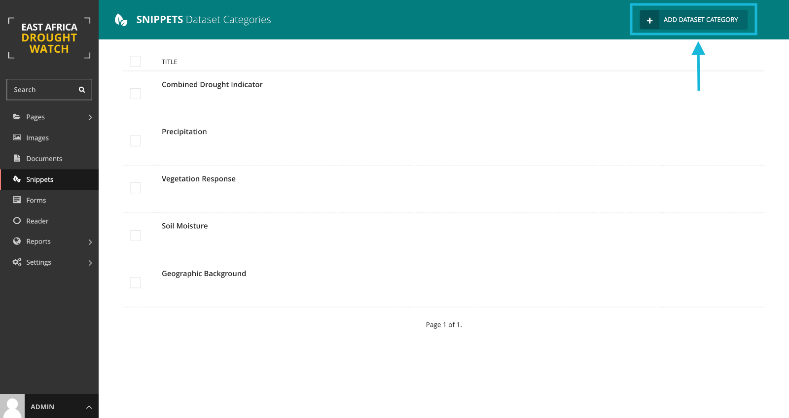
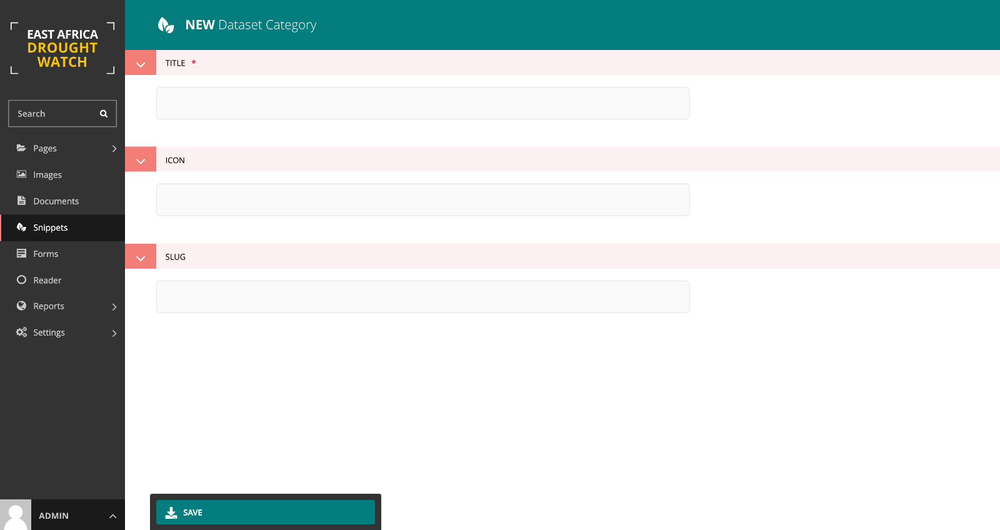
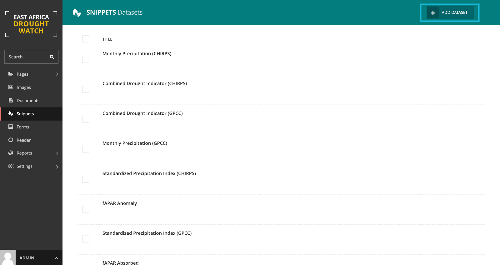
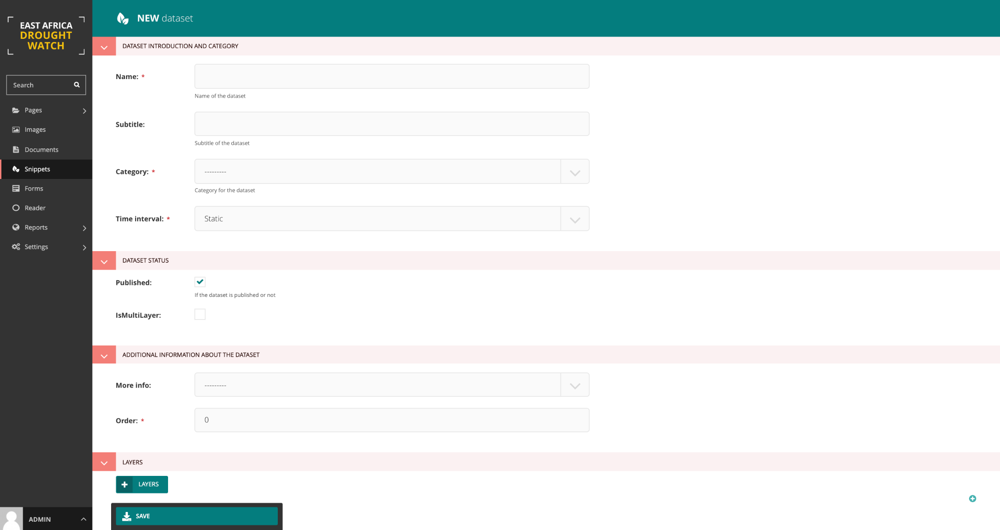
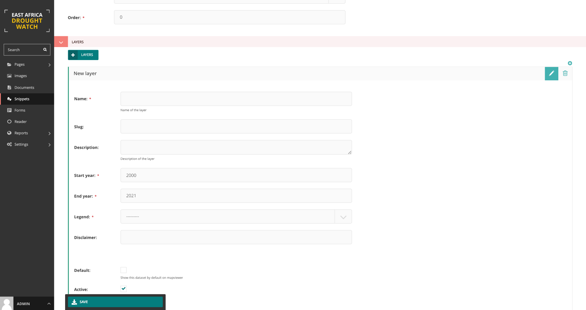
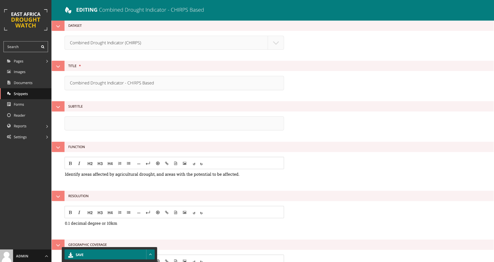

CMS Mapviewer Manager
==========================

In addition to managing static page content within the East Africa Drought Watch, the CMS also offers a layer manager which allows maintenance of the layers available on the mapviewer. This maintenance tasks which will be further explained include:

1.	Creating, updating and deleting a datasets
2.	Creating, updating and deleting a layer/ layers belonging to a dataset
3.	Creating, updating and deleting dataset categories and assigning a dataset to its relevant category
4.	Creating, updating and deleting legends (symbology) and assigning it to a layer
5.	Creating, updating and deleting metadata information and linking it to a dataset

.. image:: ../_static/maintenance_guide/layer_manager.png
   :align: center

Creating, updating and deleting legends (symbology) and assigning it to a layer
_________________________________________________________________________________

The legend describes the symbols appearing on the map to permit better understanding or interpretation of it.  Within the CMS, to create a new legend, click on the add legend button at the top right as shown below:

.. image:: ../_static/maintenance_guide/add_legend.png
   :align: center

Legend attributes include a title, a legend type (basic, choropleth, gradient) and legend items (name, color, minimum and maximum value corresponding to each class). The color must be in HEX format.

.. image:: ../_static/maintenance_guide/legend_attributes.png
   :align: center

.. note:: Creating a legend only creates the symbology representation on the mapviewer. To change the actual colors showing on the map for each layer, edit classification mapfiles as explained in MapServer mapfiles section.

Creating, updating and deleting dataset categories
_________________________________________________________________________________

Dataset categories group datasets into a common phenomena they share. eg. vegetation, precipitation, background, e.t.c.
To create a **dataset category** , under **snippets** select dataset categories option and add a data category as shown below:

Creating, updating and deleting a datasets
_________________________________________________________________________________

A dataset is a collection of layers within the mapviewer that share a common timescale, category and interest. E.g A Combined Drought Indicator dataset (multilayer) 
datasets contains both the Alert levels layer (Watch, Warning and Alert) and Recovery layer (partial and full recover). 

A dataset is said to be multilayer is it contains more than one layer. The additional layers to the active one are nested below it on the legend.

Datasets with a single layers only show a single layer on the mapviewer's layer menu.

A **published** dataset will be visible on the mapviewer. To hide the visibiility of a dataset on the mapviewer, leave the published option unchecked.

To create a **dataset** , under **snippets** select dataset option and add a dataset as shown below:

Follow instructions below to create a layer.

Creating, updating and deleting a layer/ layers belonging to a dataset
_________________________________________________________________________________

To create a layer, select **add layer** button at the bottom of the add dataset form and provide necessary information. 

.. note:: It is recommended to enable both default and active checkboxes on the form for dataset ciomprised of a sinlge layer while enabling active box only for the primary layer in a multilayer dataset.

Creating, updating and deleting metadata information and linking it to a dataset
_________________________________________________________________________________

This is the information the dataset. This includes a title, subtitle, function/purpose, resolution, Frequency of updates, geographic coverage, citation, caution, 
license, a general overview, link redirects toi download and learn more about the data , e.t.c.

To create a meatadata, select **add metadata** button in the **snippet** section  at the bottom of the add dataset form and provide necessary information. 

To create **metadata** , under **snippets** select metdata option and add metadata linking it to a dataset as shown below:

