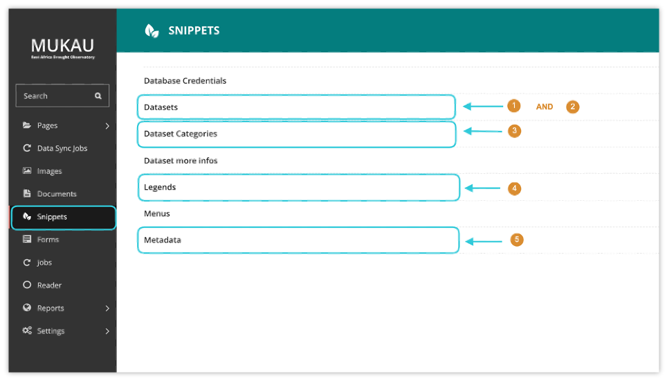
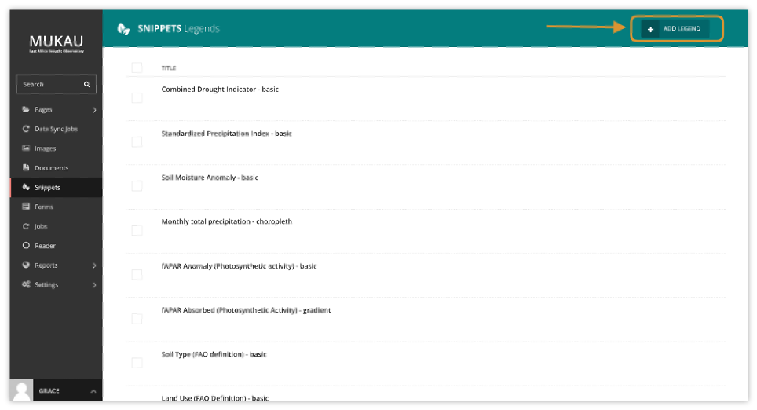
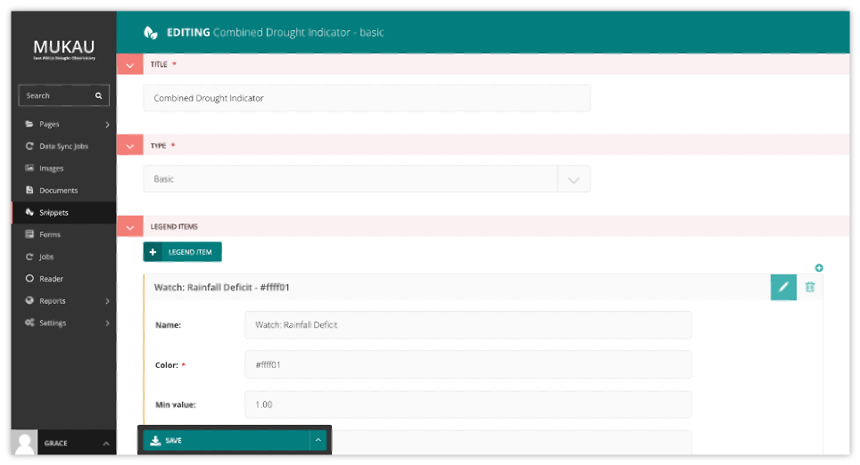

CMS Mapviewer Manager
==========================

In addition to managing static page content within the East Africa Drought Watch, the CMS also offers a layer manager which allows maintenance of the layers available on the mapviewer. This maintenance tasks which will be further explained include:

1.	Creating, updating and deleting a datasets
2.	Creating, updating and deleting a layer/ layers belonging to a dataset
3.	Creating, updating and deleting dataset categories and assigning a dataset to its relevant category
4.	Creating, updating and deleting legends (symbology) and assigning it to a layer
5.	Creating, updating and deleting metadata information and linking it to a dataset

Creating, updating and deleting legends (symbology) and assigning it to a layer
_________________________________________________________________________________

The legend describes the symbols appearing on the map to permit better understanding or interpretation of it.  Within the CMS, to create a new legend, click on the add legend button at the top right as shown below:

Legend attributes include a title, a legend type (basic, choropleth, gradient) and legend items (name, color, minimum and maximum value corresponding to each class). The color must be in HEX format.

.. note:: Creating a legend only creates the symbology representation on the mapviewer. To change the actual colors showing on the map for each layer, edit classification mapfiles as explained in MapServer mapfiles section.

.. toctree::
   :maxdepth: 2
