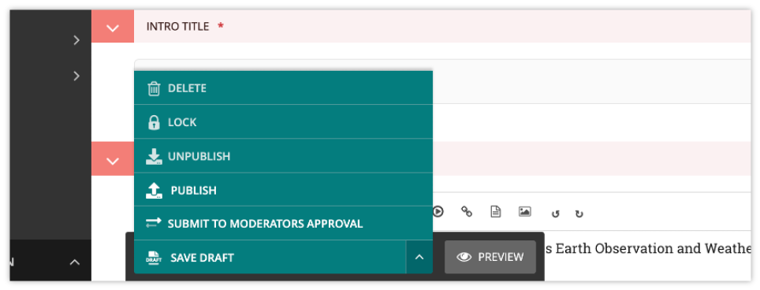

Previewing and submitting pages for moderation
===============================================

The Save/Preview/Submit for moderation menu is always present at the bottom of the page edit/creation screen. 
The menu allows you to perform the following actions, dependent on whether you are an editor, moderator or administrator:

* **Save draft**: Saves your current changes but doesn’t submit the page for moderation and so won’t be published. (all roles)

* **Submit for moderation**: Saves your current changes and submits the page for moderation. The page will then enter a moderation workflow: a set of tasks which, when all are approved, will publish the page (by default, depending on your site settings). This button may be missing if the site administrator has disabled moderation, or hasn’t assigned a workflow to this part of the site. (all roles)

* **Preview**: Opens a new window displaying the page as it would look if published, but does not save your changes or submit the page for moderation. (all roles)

* **Publish/Unpublish**: Clicking the Publish button will publish this page. Clicking the Unpublish button will take you to a confirmation screen asking you to confirm that you wish to unpublish this page. If a page is published it will be accessible from its specific URL and will also be displayed in site search results. (moderators and administrators only)

* **Delete**: Clicking this button will take you to a confirmation screen asking you to confirm that you wish to delete the current page. Be sure that this is actually what you want to do, as deleted pages are not recoverable. In many situations simply unpublishing the page will be enough. (moderators and administrators only)

.. toctree::
   :maxdepth: 2