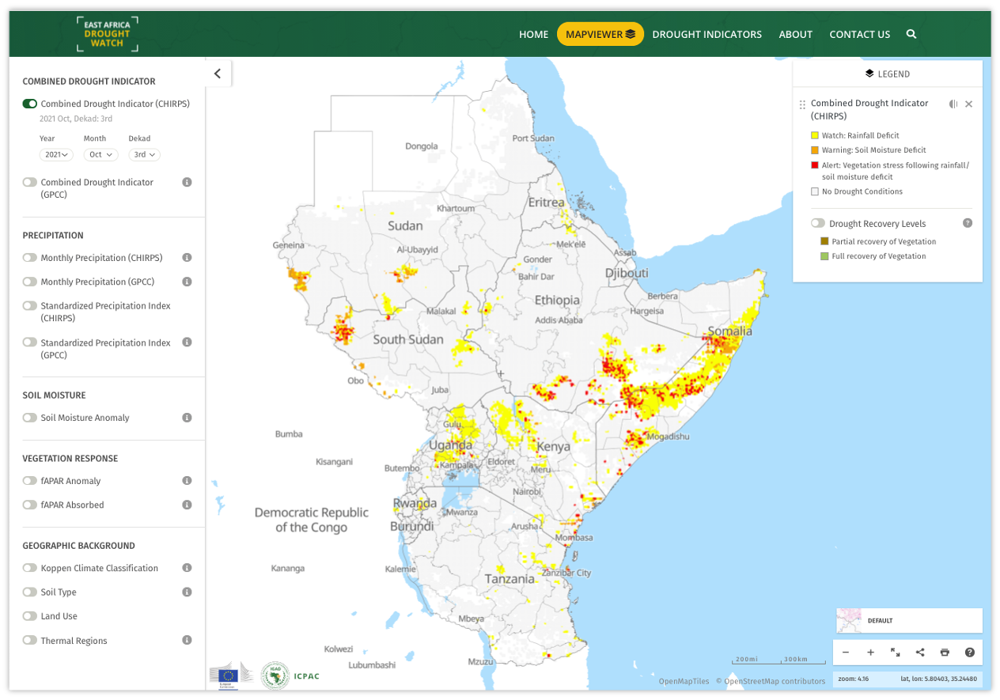

Introduction
==============

This section guides Drought Watch end-users how to utilize functionalities within the system. The system contains drought-relevant information
such as maps of indicators derived from different data sources. It provides various tools like analytical graphs and interactive layer interaction allowing
for display and analysis this drought information and drought reports give an overview of the situation in case of imminent droughts.

Visit the system at https://droughtwatch.icpac.net

It comprises of:

+ **A web-GIS environment**:

  * Weather and Earth Observation (EO) indicators 

  * Automatic warnings regarding developing or actual drought events every 10 days

  * Additional indicators showing recovery process after drought events

+ **A statistics dashboard**:

  * Indicators statistics aggregated at sub-national level(s)

  * Additional information such as periodic reports
  
On the landing page of the system (https://droughtwatch.icpac.net), the latest situation of drought based on the Combined Drought Indicator is displayed. This
Indicator is based on SPI, Soil moisture and fAPAR, to identify areas with potential to suffer agricultural drought, areas where the vegetation is already affected by drought conditions, 
and areas in recovery process to normal conditions after a drought episode. `More details <https://droughtwatch.icpac.net/documents/2/EADW-CDI-Factsheet.pdf>`_ 

Within the user guide, you will be able to undestand how to:

+ Interact with the mapviewer

+ Generate drought-relevant reports

+ Give feedback/questions relating to the System

