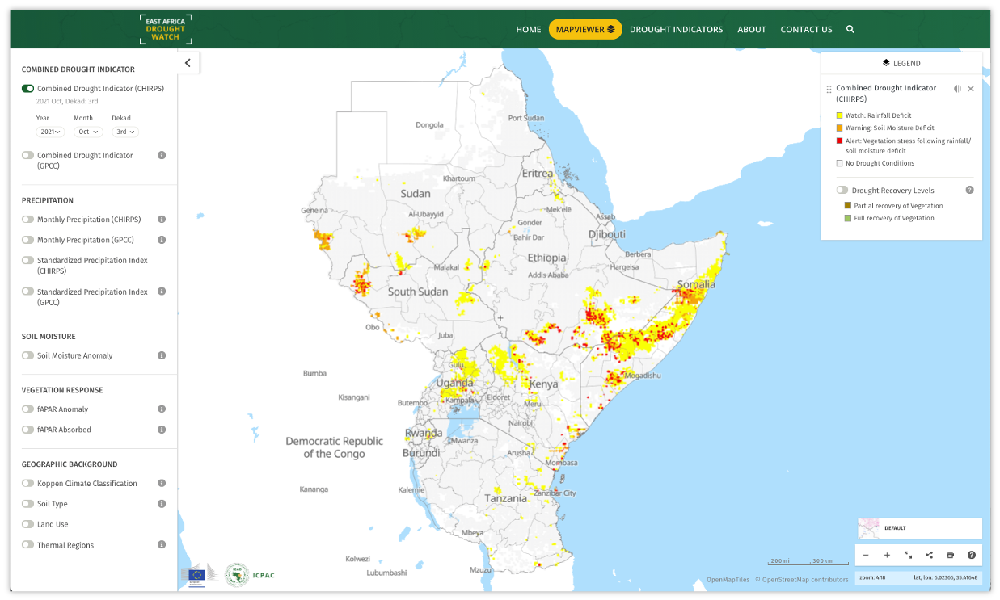
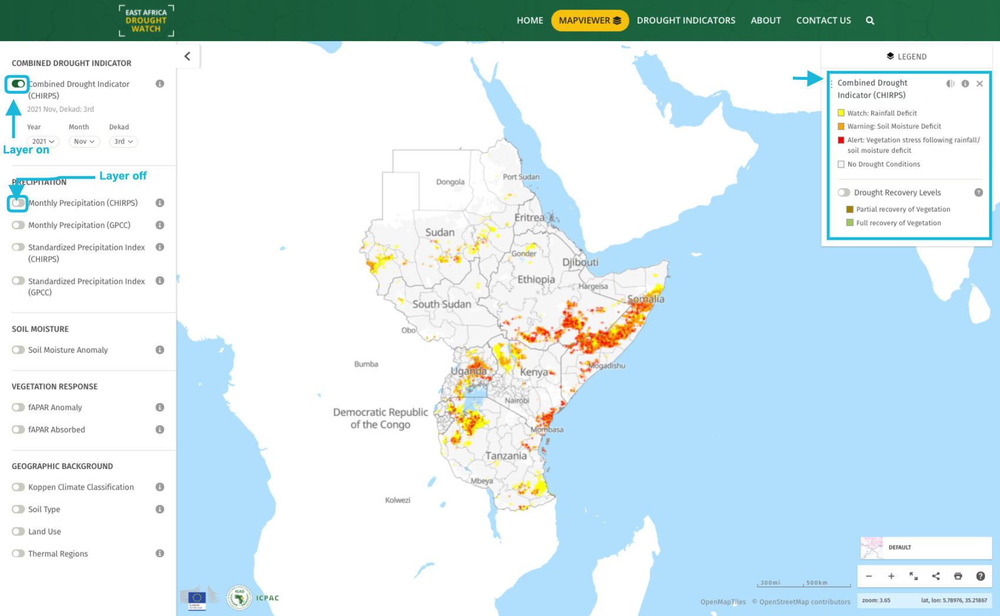
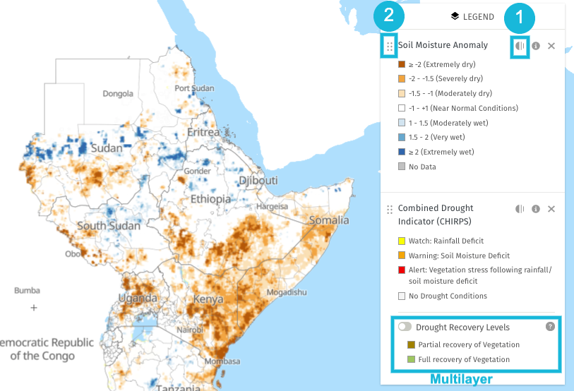
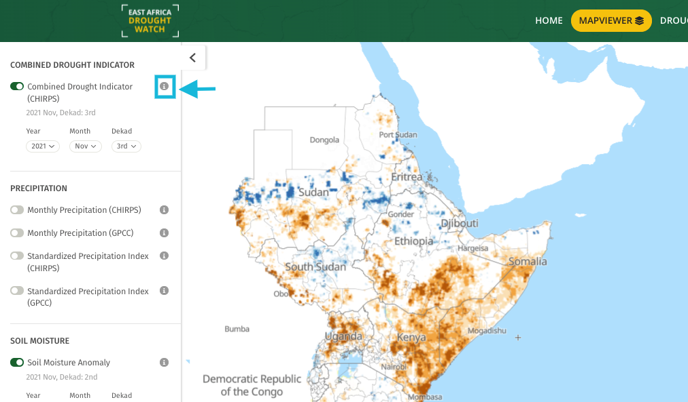
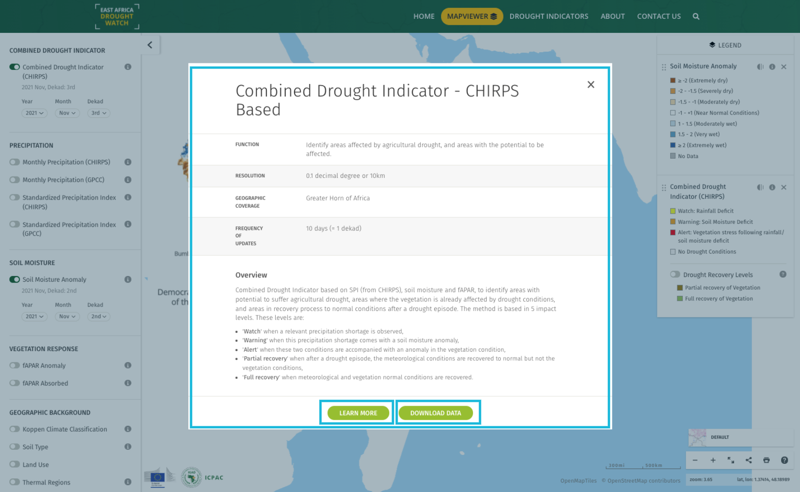
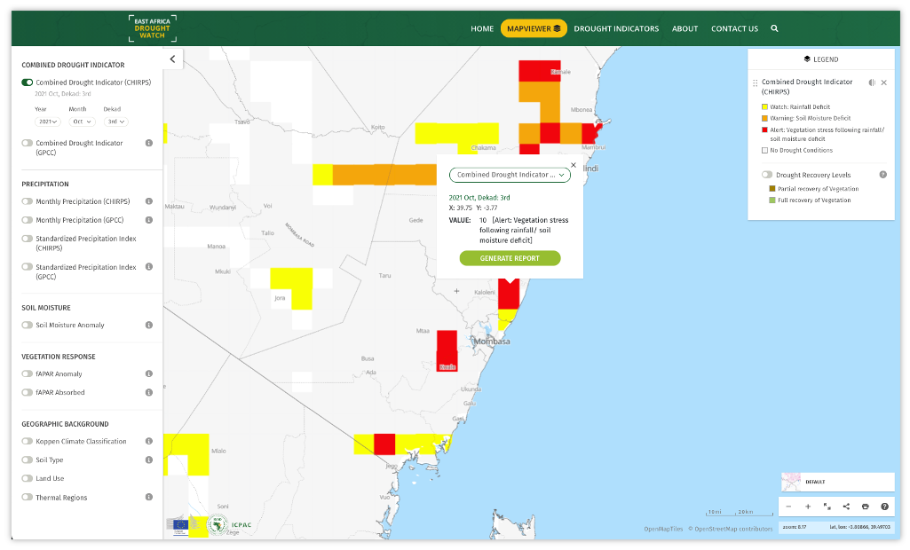
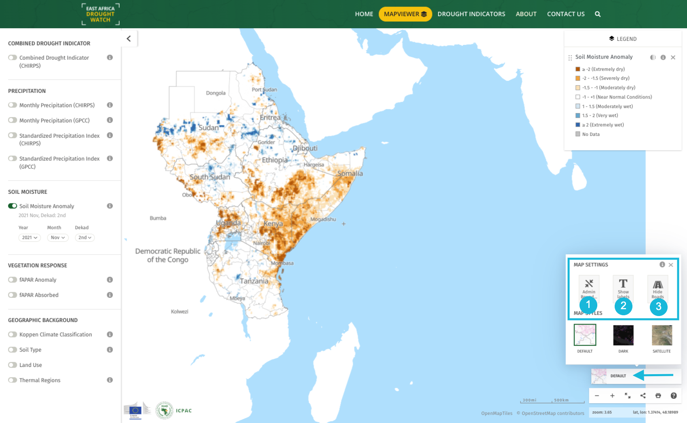
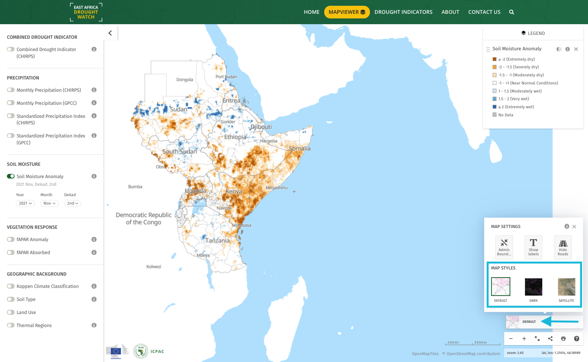

East Africa Drought Watch Mapviewer
=====================================

The East Africa Drought Watch Mapviewer is an interactive user-interface containing drought-related layers related generated from 
over a period of time from Earth Observation and Station data. 

------------

Visualization of raster layers for selected weather and biophysical indicators and anomalies
_____________________________________________________________________________________________

The system's mapviewer houses a number of layers. Each layer can be displayed on the map through toggling it on and off. A legend will be displayed on the right 
for each layer that has been activated. 

For multilayers, a secondary layer will appear on the legend which can also be toggled on and off. 

To facilitate better image interpretation, it is possible to change the opacity for activated layers within the legend (1). It is also possible to 
rearrange the order of activated layers(2) by dragging them from to top or bottom on the legend. 

------------

Layer metadata
_____________________

Inorder to have an indepth understanding on how layers are generated/computed, each layer contains metadata that is accessible using the info icon 
beside the layer name. The layer metadata includes:

+ The function

+ Resolution

+ Geographic coverage

+ Source

+ Frequency of updates

+ General Overview of the layer

+ Citation

+ Caution

+ License

+ Link to learn more (factsheets) or download raster data

------------

Retrieve pixel value
_________________________

To retrieve the value of a pixel of interest on the map, click on this pixel. A popup appears displaying a drop-down of activated layers,
the selected date, the location and the value for this pixel. Switch between activated layers using the dropdown to view dataset values for the same pixel.

------------

Manage Map Settings
_____________________

To acces map settings click on the 'Default' map image at the bottom right corner of the mapviewer. Map settings allow you to:

1. Disable/Enable admin boundaries

2. Show/hide labes on the map

3. Show/hide roads on the map

------------

Manage Map Styles
_____________________

To switch between various basemaps, click on the 'Default' map image at the bottom right corner of the mapviewer and select a basemap
of preference.

