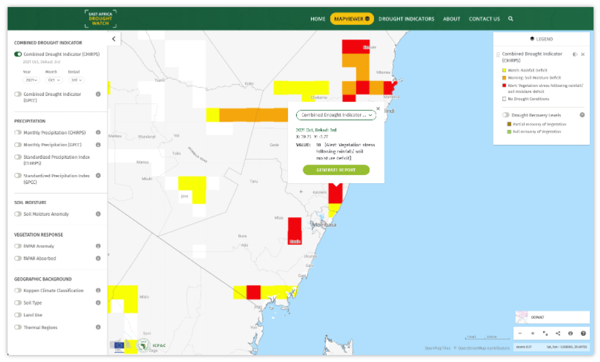
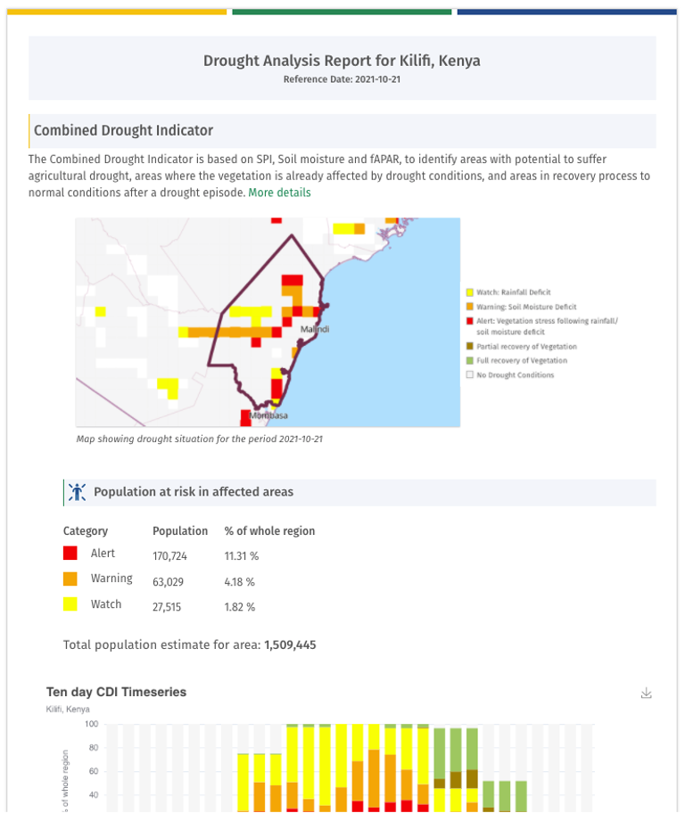

Report Generation
==================

In addition to the mapviewer, the East Afric Drought Watch allows for generation of drought reports at admin level 1 based on the pixel of interest and
the time period selected. These drought reports contain both maps and graphs giving a summarized analysis of the situation of each drought layer. 

To generate a report, click on a pixel of interst on the mapviewer and select 'generate report button' on the popup. This will redirect you to the dashboard/report page 
for the drought watch.

