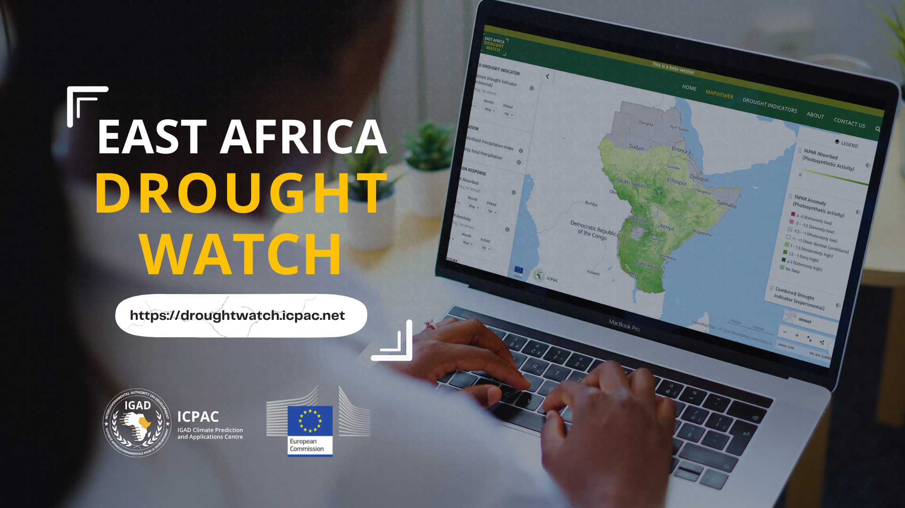

East Africa Drought Watch
============================

.. toctree::
   :maxdepth: 2
   :hidden:
   :caption: About

   /About/general_information
   /About/faq
   
.. toctree::
   :maxdepth: 2
   :hidden:
   :caption: Background

   /Background/introduction
   /Background/calculate_CDI
   /Background/calculate_SPI
   /Background/calculate_FAPAR_ANOM
   /Background/calculate_SMA

.. toctree::
   :maxdepth: 2
   :hidden:
   :caption: User Guide

   /User_Guide/introduction
   /User_Guide/mapviewer
   /User_Guide/report
   /User_Guide/feedback
   
.. toctree::
   :maxdepth: 2
   :hidden:
   :caption: Maintenance Guide

   /Maintenance_Guide/introduction
   /Maintenance_Guide/cms_components
   /Maintenance_Guide/cms_display_page
   /Maintenance_Guide/cms_edit_page
   /Maintenance_Guide/cms_edit_page_tab
   /Maintenance_Guide/cms_page_moderation
   /Maintenance_Guide/cms_admin_tasks
   /Maintenance_Guide/cms_mapviewer_manager

.. toctree::
   :maxdepth: 2
   :hidden:
   :caption: Data Manager Guide

   /Data_Manager_Guide/introduction
   /Data_Manager_Guide/usage

The **East Africa Drought Watch** is a near-real time system that uses **Earth Observation and Weather information** to **monitor drought conditions** in the **East Africa** region. It contain drought-relevant information such as maps of indicators derived from different data sources (e.g., precipitation measurements, satellite measurements, modelled soil moisture content). Different tools, like Graphs and Compare Layers, allow for displaying and analysing the information and drought reports give an overview of the situation in case of imminent droughts.

The system is a service **developed as part of the Intra-ACP Climate Services Project** in collaboration with the **Drought Unit at the Joint Research Centre of the European Commission**. The system is an **adaptation of the European Drought Observatory (EDO)** adapted to the conditions in the East Africa region
The (JRC) currently operates two Drought Observatories (DO): European Drought Observatory (EDO) and the Global Drought Observatory (GDO). These platforms are based on a shared technical platform that implements the above components and other additional enhancements. 

